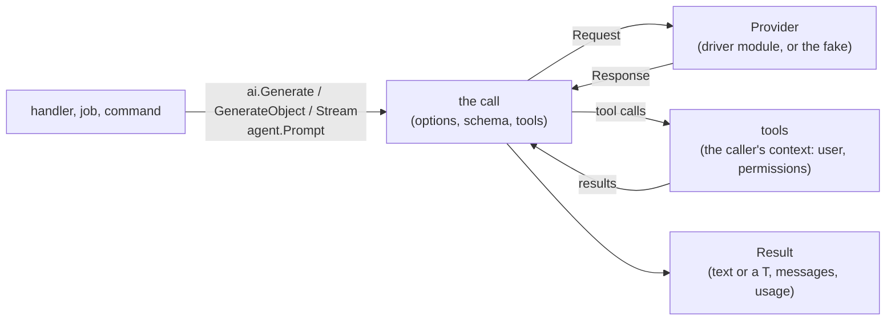

# AI

How package `ai` connects language models to the app, and what it
leaves to the providers.

## Integration, not a framework

Go has capable libraries for models: the providers' official SDKs, and
frameworks such as Genkit, Eino and LangChainGo. What none has is the
rest of a web app. Package `ai` is thin: a provider contract, messages,
the tool loop, typed outputs and a fake. Providers are driver modules
that wrap the official SDKs, so the core module depends on none of them,
and an app depends only on the SDK it uses.

Providers add features every month (reasoning, prompt caching,
citations, their own hosted tools). The common contract covers what
apps need everywhere: text, tools, structured output, streaming and
usage. The rest stays reachable: `ai.ProviderOptions` passes a driver's
own request options, `Response.Raw` holds the provider's own response,
and `Client.Provider()` leads to the driver's SDK client.

## A call

Every call (`ai.Generate`, `ai.GenerateObject`, `ai.Stream`, an agent's
`Prompt` or `Stream`) runs the same loop:

1. The options are applied: the client's defaults (`AI_MODEL`,
   `AI_MAX_TOKENS`, `AI_TIMEOUT`), then an agent's, then the call's own.
2. A request goes to the provider: instructions, the conversation, the
   tools' definitions, and for `GenerateObject` the output schema.
3. If the model called tools, each runs, in order, and their results go
   back to the model in the next request. This repeats until the model
   answers without calling a tool, or `MaxSteps` is reached.
4. The result holds the answer, every response (one per step), the
   total usage and the whole conversation, which marshals to JSON.

Each request has its own timeout (in a stream, the reader's time
counts); the caller's context bounds the whole call, and canceling it
stops the call between requests, and during one as far as the provider
honors it.

## Typed outputs and tools

Typed outputs and tool inputs are structs. Their JSON schema comes from
the same tags as the rest of the app: `json` names, `description` for
what a field means, and `validate` rules (`required`, `max`, `in`,
`email`…) where JSON Schema can say them. Schemas are built once per type.

What the model sends is then checked with the same rules a request's
input would be. A tool's invalid input goes back to the model, which can
correct it; a typed answer that fails goes back once, with the problems,
and a second failure is an `*ai.OutputError` (a 502 for the web: the
model, upstream, failed).

## Tools act as the user

A tool runs with the context of the call: the request's, with its
signed-in user. Inside, `auth.Current`, policies and scoped queries work
as in a handler, so a model can do no more than the user could, whatever
text it read. A tool's error with a 4xx status (not allowed, not found,
invalid) is told to the model as a web client would see it, never with
its internal cause; any other error stops the call and is returned, as
it would end a request.

Each tool call is a unit of work (`anetos.Unit`, kind `tool`): repeated
queries in it are reported as in a request or a job.

## Logs

Each request to a model is logged at Info level with the provider,
model, step, stop reason, input and output tokens and duration; each
tool call with its name, duration and error. Prompts and answers are
never logged: they are the users' data.

## Testing

Model output varies and costs money, so tests don't call a model:
`anetostest` sets `AI_PROVIDER=fake`, and `anetostest.FakeAI` scripts
the answers, one per request. Everything around the model runs for real:
schemas, validation, retries, tools, the loop. The fake records each
request, for assertions on what the model was sent.

## Not in scope

Multi-agent orchestration graphs, prompt template languages and a
vector database of its own are out of scope. Conversations stored in the
database, usage budgets, generation in queue jobs, server-sent events,
embeddings and vector search are planned.

## See also

- [Add AI to your app](../guides/ai.md)
- [AI reference](../reference/ai.md)
- [Testing](testing.md)
