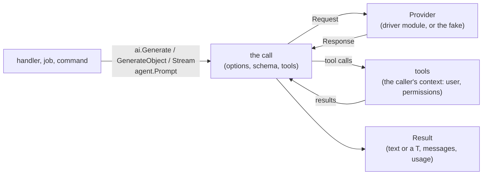

# AI

How package `ai` connects language models to the app, and what it
leaves to the providers.

## Integration, not a framework

Go has capable libraries for models: the providers' official SDKs, and
frameworks such as Genkit, Eino and LangChainGo. What none has is the
rest of a web app. Package `ai` is thin: a provider contract, messages,
the tool loop, typed outputs and a fake. Providers are driver modules
that wrap the official SDKs (Anthropic, OpenAI and OpenAI-compatible
servers, Gemini), so the core module depends on none of them, and an
app depends only on the SDKs it uses.

Providers add features every month (reasoning, prompt caching,
citations, their own hosted tools). The common contract covers what
apps need everywhere: text, tools, structured output, streaming and
usage. The rest stays reachable: `ai.ProviderOptions` passes a driver's
own request options, `Response.Raw` holds the provider's own response,
and `Client.Provider()` leads to the driver's SDK client.

## Providers

The drivers (`drivers/anthropic`, `drivers/openai` with its
OpenAI-compatible mode, `drivers/gemini`) translate the common request
to their API and back. Three things don't map one to one, and the
drivers handle them the same way:

- **Structured output** has a JSON Schema dialect per provider. A
  struct's schema is adapted to it (`Schema.Map`): rules the provider
  doesn't take become words in the field's description, so the model
  still sees them, and validation enforces them on the answer.
- **Reasoning state:** models that think must see their earlier
  reasoning when they continue after tool calls (Claude's thinking
  blocks, Gemini's thought signatures). It's an `ai.Reasoning` part in
  the model's message, kept with the conversation like any part, and
  left out by other providers. A conversation can mostly change
  provider: Gemini takes another model's tool calls with a placeholder
  signature, which the driver adds, but Claude with extended thinking
  can't continue a tool call it didn't make.
- **Errors** are the SDKs' own, wrapped with the provider's name. Rate
  limits and server errors are retried twice first.

Every driver passes one conformance suite (`ai/aitest`). It runs
against recordings of the provider's HTTP exchanges, so it's fast and
needs no key, and it checks the requests the driver sends as well as how
it reads the answers. With a key, it records the exchanges again from
the live API.

## A call

Every call (`ai.Generate`, `ai.GenerateObject`, `ai.Stream`, an agent's
`Prompt` or `Stream`) runs the same loop:

1. The options are applied: the client's defaults (`AI_MODEL`,
   `AI_MAX_TOKENS`, `AI_TIMEOUT`), then an agent's, then the call's own.
2. A request goes to the provider: instructions, the conversation, the
   tools' definitions, and for `GenerateObject` the output schema.
3. If the model called tools, each runs, in order, and their results go
   back to the model in the next request. This repeats until the model
   answers without calling a tool, or `MaxSteps` is reached.
4. The result holds the answer, every response (one per step), the
   total usage and the whole conversation, which marshals to JSON.

Each request has its own timeout (in a stream, the reader's time
counts); the caller's context bounds the whole call, and canceling it
stops the call between requests, and during one as far as the provider
honors it.

## Typed outputs and tools

Typed outputs and tool inputs are structs. Their JSON schema comes from
the same tags as the rest of the app: `json` names, `description` for
what a field means, and `validate` rules (`required`, `max`, `in`,
`email`…) where JSON Schema can say them. Schemas are built once per type.

What the model sends is then checked with the same rules a request's
input would be. A tool's invalid input goes back to the model, which can
correct it; a typed answer that fails goes back once, with the problems,
and a second failure is an `*ai.OutputError` (a 502 for the web: the
model, upstream, failed).

## Tools act as the user

A tool runs with the context of the call: the request's, with its
logged-in user. Inside, `auth.Current`, policies, permissions
(`rbac.Authorize`) and scoped queries work as in a handler, so a model
can do no more than the user could, whatever text it read. Within that,
text the model reads (a page, an email, a document) can steer it into
calling the user's tools against their wishes (prompt injection): give
an agent the tools its task needs, read-only where you can, and confirm
with the user before tools that change or send things. A tool's error with a 4xx status (not allowed, not found,
invalid) is told to the model as a web client would see it, never with
its internal cause; any other error stops the call and is returned, as
it would end a request.

Each tool call is an operation (`anetos.Operation`, kind `tool`): repeated
queries in it are reported as in a request or a job.

## Logs

Each request to a model is logged at Info level with the provider,
model, step, stop reason, input and output tokens and duration; each
tool call with its name, duration and error. Prompts and answers are
never logged: they are the users' data.

## Conversations

A stored conversation (`ai.Conversation`) is a row of
`ai_conversations` with its messages in `ai_messages`, one row each, as
JSON: text, tool calls and results, and the reasoning some models need
back. It belongs to a user, and `ai.FindConversation` finds it only for
that user, so an ID in a URL can't reach another's.

A call on a conversation (`Prompt`, `Stream`, `Reply`, `StreamReply`)
loads its messages, sends them with the new question, and, once the
answer is complete, stores everything new in one transaction: the
question, the model's messages, the tools' results. It stores nothing
if the call fails, and refuses to store if another call added messages
in the meantime (`ErrConversationChanged`), since an answer belongs after
the question it answers. A page can store the question first (`Add`)
and stream the answer from another request (`StreamReply`): the question
is kept if the answer fails, and can be answered again.

## Streaming to the browser

`ai.SSE` writes a streamed answer as server-sent events (`text`,
`tool`, `error`, `done`), HTML-escaped for htmx's SSE extension, which
`view/htmx` bundles. The stream goes through `c.EventStream()`, which lifts
the request's timeout and the server's write timeout for that response:
an answer can take minutes, and still stops when the browser leaves,
which stops the model. A comment every 15 seconds keeps proxies from
closing a stream while the model thinks or a tool runs. Errors become an `error` event, with the
message of a 4xx error (a spent budget) or a general one (others are
logged), followed by `done`, so the page closes the stream instead of
reconnecting.

## Queued replies

`conv.QueueReply` answers from a queue job (`ai.QueueAgents` registers
the job type, with the agents it may run, found by name: a job carries
the name, not the agent). The job acts as the conversation's user
(`auth.WithUser`), so the agent's tools see the same user as in a request,
limited to the abilities of the API token the reply was queued with, if
any. Retries follow the queue's settings, and start the reply over: the
tools run again, so tools that change things must be safe to repeat. The conversation's `Status`
says where it stands (`queued`, or `failed` with a message for the
user). A job remembers how many messages the conversation had: if that
changed (the reply was stored by an earlier attempt, or the user asked
something else), it does nothing, so a question gets one answer however
often the job runs.

## Usage and budgets

With `client.TrackUsage`, every model response is recorded in
`ai_usage` for its user (the logged-in user, or `ai.ForUser`'s), with
its conversation, agent, model, tokens and cost at the app's prices. A
budget (tokens or cost per period, per user, from a function of the
user, so plans can differ) is counted on the rate limiter, in the app's
cache, and checked before each request to the model: a call over
budget fails with a 429 before it spends more. A single response can
go past the budget, since its length isn't known beforehand. A stream
the reader leaves partway (a closed tab), or a request cut off by a
timeout or a cancellation, has spent tokens too, which the provider
never reports: it's recorded and counted with an estimate, about four
bytes a token for its input and what it yielded (reasoning a model did
without showing it can't be counted). Records are
written even if the client has gone, but in the call's transaction, if
any: one that rolls back takes them with it, so models aren't called
inside transactions (on SQLite, the transaction would also hold the
write lock for the whole call).

## Embeddings and retrieval

An agent answers from the app's data through its tools; for text that
is searched by meaning (help articles, documents, notes), `ai.Embeddings`
keeps each record's chunks and their vectors in a table next to the
record's, in the app's own database (pgvector, MariaDB's vectors, or
SQLite), not in a separate vector store: the chunks commit and roll
back with the data, deleting a record deletes them, and a search joins
them with the record's table, so its conditions, scopes and soft deletes
apply. A search is hybrid when the table has a full-text index too: the
two rankings are merged by rank (reciprocal rank fusion), so a rare word
or a product code still finds its record when its meaning is vague.

Embeddings depend on the model that made them: vectors of two models
can't be compared. Each chunk records its model, searches use only the
current model's chunks, and `ai:embed` re-embeds after a change. The
embedding provider can differ from the chat provider
(`AI_EMBEDDING_PROVIDER`): Anthropic has no embeddings. See
[Search by meaning](../guides/semantic-search.md).

## Testing

Model output varies and costs money, so tests don't call a model:
`anetostest` sets `AI_PROVIDER=fake`, and `anetostest.FakeAI` scripts
the answers, one per request. Everything around the model runs for real:
schemas, validation, retries, tools, the loop. The fake records each
request, for assertions on what the model was sent. It makes embeddings
too, from the texts' words (texts that share words are near), so a
search works in tests without a model.

## Not in scope

Multi-agent orchestration graphs, prompt template languages and a
vector database of its own are out of scope: embeddings live in the
app's database. Vertex AI, Bedrock and Azure OpenAI's own
authentication are planned (their APIs work through a proxy URL until
then), as are files (images, documents) as inputs.

## See also

- [Add AI to your app](../guides/ai.md)
- [Build an AI assistant](../guides/ai-assistant.md)
- [Search by meaning](../guides/semantic-search.md)
- [AI reference](../reference/ai.md)
- [Testing](testing.md)
