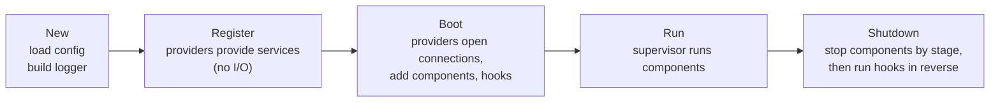

# Application lifecycle

An Anetos application goes through five phases: **New → Register → Boot →
Run → Shutdown**. Knowing which code runs in which phase tells you where to
put configuration, wiring, connections and cleanup.



## The phases

| Phase | Triggered by | What happens | Your code |
|---|---|---|---|
| **New** | `anetos.New()` | Loads configuration (environment, `.env.<APP_ENV>`, `.env`), binds and validates `AppConfig`, builds the logger | Options such as `WithSource`, `WithLogger` |
| **Register** | `app.Boot` / `app.Run` | Each provider's `Register`, in `Use` order | Provide services, read config. No I/O, no goroutines |
| **Boot** | `app.Boot` / `app.Run` | Each provider's `Boot`, in `Use` order | Open connections, add components, register shutdown hooks |
| **Run** | `app.Run(ctx, roles...)` | The supervisor starts the selected components | Components do their work |
| **Shutdown** | `ctx` canceled (e.g. SIGTERM) or a fatal component failure | Components stop stage by stage, then hooks run in reverse order | Components return promptly; hooks release resources |

Because **every** Register runs before **any** Boot, a provider's Boot can
use services provided by providers added after it. Order still matters for
Boot itself and for shutdown hooks.

## Setting up the services

A new project's `main.go` builds its services in one function, `setup`,
which runs after `anetos.New` and before `Register`. Each service is built from
the app's settings by its package's `New`, and `db.Connect` connects to
the database:

```go
// illustrative (the start of a new project's setup)
func setup(app *anetos.App) (*web.Server, error) {
	if _, err := db.Connect(context.Background(), app, sqlite.Driver()); err != nil {
		return nil, err
	}
	if _, err := cache.New(app); err != nil { // CACHE_STORE
		return nil, err
	}
	q, err := queue.New(app) // QUEUE_DRIVER
	if err != nil {
		return nil, err
	}
	// … the mailer, storage, the scheduler, sessions
	return web.NewServer(app)
}
```

Each `New(app, …)`:

- reads its settings (`CACHE_*`, `QUEUE_*`…) and fails, naming the
  setting, when one is wrong;
- puts the service in the app's contexts and container, so a handler or a
  job reaches it with `cache.From(ctx)` and other packages with
  `anetos.Resolve[*cache.Cache](app)`;
- adds what goes with it: its commands (`migrate`, `queue:failed`,
  `cache:clear`…), a shutdown hook that closes its connection, doctor
  checks.

A service is built once per app: a second `New` for the same app is an
error. Order matters only where one service uses another (the mailer
queues mail when the queue exists; plugins come last), and the generated
`setup` is already in that order. Outside an app (a test, a tool),
each package has a constructor from explicit parts, such as
`cache.NewWithStore(store, prefix)` or `events.NewBus()`.

## Providers

A provider packages a piece of your own functionality with the two
phases above:

```go
// illustrative (from app.go)
type Provider interface {
	Name() string
	Register(a *App) error
	Boot(ctx context.Context, a *App) error
}
```

`app.Use(provider)` adds one; its `Register` and `Boot` run with the
others'. The framework's services don't need it (they're built in
`setup`), and plugins use their own interface ([Plugins](../guides/plugins.md)).
A complete provider is in
[`examples/lifecycle`](../../../examples/lifecycle/main.go) (region
`provider`).

## The service container

`anetos.Provide[T](app, v)` stores a value under its **static type** `T`;
`anetos.Resolve[T](app)` gets it back. It's a map, not a dependency-injection
engine: there's no autowiring and no reflection over constructors.

Use it to hand services from one provider to another at boot. Inside your
application code, prefer ordinary constructor parameters:

```go
// illustrative
d := anetos.MustResolve[*db.DB](app) // at boot
posts := handlers.NewPosts(d)        // plain Go from here on
```

Resolving from the container on every request works, but it hides
dependencies and costs a map lookup each time.

## Context values

A few services are needed by nearly every function that has a context: the
database connection is the main one. `app.AddContextValue(key, value)`
(called while providers register or boot) adds a value to every context
the app hands out: providers' Boot, components and `app.Go` tasks, HTTP
requests, and shutdown hooks. `app.Context(ctx)` adds the same values to a
context the app didn't create, such as in a CLI command or a test.

`db.Connect` uses this, which is why `db.Query[Post](c)` works in a handler
with nothing but the request context. Keep it for such cross-cutting
services; ordinary dependencies still belong in constructors.

The app's own context values are its clock and its logger:
`anetos.Now(ctx)` reads the time tests can freeze, and
`anetos.Logger(ctx)` returns the app's logger (`LOG_LEVEL`, `LOG_FORMAT`,
with the app's name and environment), so jobs, listeners and scheduled
tasks log like the rest of the app:

```go
// illustrative
anetos.Logger(ctx).InfoContext(ctx, "invoice sent", "invoice", inv.ID)
```

Plain `slog.Info` writes through Go's default logger instead, which the
app leaves alone. In handlers, `c.Logger()` adds the request ID and
route.

## Failures during startup

- `anetos.New` returns an error that lists **every** invalid or missing setting.
- If a provider's Register or Boot fails, Boot stops, **runs the shutdown
  hooks registered so far** (so connections opened by earlier providers are
  closed), and returns the error. The app can't be started again after that.

## Shutdown

1. The supervisor cancels components **stage by stage**: HTTP first, then
   the scheduler, listeners, workers and background tasks, each stage
   draining before the next is canceled. See the
   [runtime supervisor](runtime-supervisor.md).
2. Shutdown hooks (`app.OnShutdown`) run in **reverse** registration order,
   so a pool opened first is closed last. Every hook runs even if an
   earlier one fails; failures and panics are collected into `Run`'s error.

`APP_SHUTDOWN_TIMEOUT` (default 30s) is the **total** budget. Components use
it first, but hooks always keep the smaller of 5s and a fifth of it, so
cleanup still happens if a component hangs. Hooks run even then, so a stuck
component may briefly outlive the resources it uses; the error returned by
`Run` names it.

## Boot without Run

One-off programs (a migration, a report) can call `app.Boot(ctx)`, use the
services, then `app.Close()` to run the shutdown hooks. `Close` refuses to run
while `Run` is in progress; cancel `Run`'s context instead.

> **Coming from Laravel?** `setup` is where Laravel's service providers and
> `config/*.php` meet: each `New(app)` reads its `.env` keys and registers
> the service. There are no facades or global container: the `App` is
> passed explicitly, and a handler gets a service from its context
> (`cache.From(c)`). Your own providers play the role of a service
> provider's `register()` and `boot()`.

## Related

- [Configure your application](../guides/configuration.md)
- [Run background tasks](../guides/background-tasks.md)
- [Runtime supervisor](runtime-supervisor.md)
