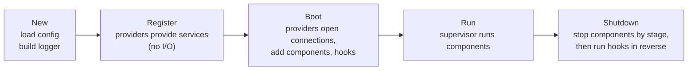

# Application lifecycle

A Anetos application goes through five phases: **New → Register → Boot →
Run → Shutdown**. Knowing which code runs in which phase tells you where to
put configuration, wiring, connections and cleanup.



## The phases

| Phase | Triggered by | What happens | Your code |
|---|---|---|---|
| **New** | `anetos.New()` | Loads configuration (environment, `.env.<APP_ENV>`, `.env`), binds and validates `AppConfig`, builds the logger | Options such as `WithSource`, `WithLogger` |
| **Register** | `app.Boot` / `app.Run` | Each provider's `Register`, in `Use` order | Provide services, read config. No I/O, no goroutines |
| **Boot** | `app.Boot` / `app.Run` | Each provider's `Boot`, in `Use` order | Open connections, add components, register shutdown hooks |
| **Run** | `app.Run(ctx, roles...)` | The supervisor starts the selected components | Components do their work |
| **Shutdown** | `ctx` canceled (e.g. SIGTERM) or a fatal component failure | Components stop stage by stage, then hooks run in reverse order | Components return promptly; hooks release resources |

Because **every** Register runs before **any** Boot, a provider's Boot can
use services provided by providers added after it. Order still matters for
Boot itself and for shutdown hooks.

## Providers

A provider packages one piece of functionality:

```go
// illustrative (from app.go)
type Provider interface {
	Name() string
	Register(a *App) error
	Boot(ctx context.Context, a *App) error
}
```

The framework's own features (database, sessions, queue…) will be providers,
and the public plugin API (roadmap B11) builds on this interface. A complete
provider is in [`examples/lifecycle`](../../../examples/lifecycle/main.go)
(region `provider`).

## The service container

`anetos.Provide[T](app, v)` stores a value under its **static type** `T`;
`anetos.Resolve[T](app)` gets it back. It's a map, not a dependency-injection
engine: there's no autowiring and no reflection over constructors.

Use it to hand services from one provider to another at boot. Inside your
application code, prefer ordinary constructor parameters:

```go
// illustrative
db := anetos.MustResolve[*sql.DB](app) // at boot
posts := handlers.NewPosts(db)         // plain Go from here on
```

Resolving from the container on every request works, but it hides
dependencies and costs a map lookup each time.

## Context values

A few services are needed by nearly every function that has a context: the
database connection is the main one. `app.AddContextValue(key, value)`
(called while providers register or boot) adds a value to every context
the app hands out: providers' Boot, components and `app.Go` tasks, HTTP
requests, and shutdown hooks. `app.Context(ctx)` adds the same values to a
context the app didn't create, such as in a CLI command or a test.

`db.Connect` uses this, which is why `db.Query[Post](c)` works in a handler
with nothing but the request context. Keep it for such cross-cutting
services; ordinary dependencies still belong in constructors.

## Failures during startup

- `New` returns an error that lists **every** invalid or missing setting.
- If a provider's Register or Boot fails, Boot stops, **runs the shutdown
  hooks registered so far** (so connections opened by earlier providers are
  closed), and returns the error. The app can't be started again after that.

## Shutdown

1. The supervisor cancels components **stage by stage**: HTTP first, then
   the scheduler, listeners, workers and background tasks, each stage
   draining before the next is canceled. See the
   [runtime supervisor](runtime-supervisor.md).
2. Shutdown hooks (`app.OnShutdown`) run in **reverse** registration order,
   so a pool opened first is closed last. Every hook runs even if an
   earlier one fails; failures and panics are collected into `Run`'s error.

`APP_SHUTDOWN_TIMEOUT` (default 30s) is the **total** budget. Components use
it first, but hooks always keep the smaller of 5s and a fifth of it, so
cleanup still happens if a component hangs. Hooks run even then, so a stuck
component may briefly outlive the resources it uses; the error returned by
`Run` names it.

## Boot without Run

One-off programs (a migration, a report) can call `app.Boot(ctx)`, use the
services, then `app.Close()` to run the shutdown hooks. `Close` refuses to run
while `Run` is in progress; cancel `Run`'s context instead.

> **Coming from Laravel?** Providers play the role of service providers'
> `register()` and `boot()`, but without facades or a global container: the
> `App` is passed explicitly.

## Related

- [Configure your application](../guides/configuration.md)
- [Run background tasks](../guides/background-tasks.md)
- [Runtime supervisor](runtime-supervisor.md)
