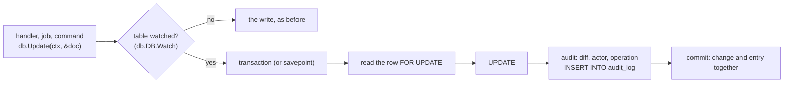

# The audit log

How package `audit` records every change of the models an app tracks,
and why its entries can be trusted to match the data.

## The data layer is watched, not changed

`db` knows nothing about auditing. It lets a package watch the writes to
a table (`DB.Watch`), and tells the watcher about each one: the kind of
write, the row's key, its values before and after, or, for a write to
many rows, the condition, the assignments and every row's key.
`audit.Track` is such a watcher, and so could be a cache or a search
index that must follow the data.

Every write the `db` package makes goes through this: `Create`,
`CreateMany`, `Upsert`, `Update`, `Save`, `Delete`, `ForceDelete`,
`Restore`, and a query's `Update`, `Delete`, `ForceDelete` and
`Restore`. Raw SQL (`db.Exec`), pivot writes and the database's own
cascades don't, and aren't recorded.

## One transaction, so the log can't drift

The entry is written in the transaction of the change, after it. If the
change commits, its entry commits with it; if anything fails (the write,
the entry, a hook, your own code later in the same transaction), both
roll back. There is no window in which a change exists without its
entry, and no entry describes something that didn't happen. A log
written by a queue job after the commit couldn't promise either.

Watched writes always run in a transaction: a savepoint inside one you
opened (`db.Tx`), or one of their own. Model hooks then run inside it.

## "Before" comes from the database

`db.Update` writes every column of the struct and keeps no snapshot of
what was loaded, so the values before are read again, `FOR UPDATE`, in
the transaction, just before the write. They are what the database
held, even if another request changed the row after your handler loaded
it, and the lock keeps anyone else from changing it until the commit.
The watcher compares before and after; only the columns that differ are
recorded, and an update that changes nothing but timestamps isn't.

## Bulk writes: one entry, every key

A write to many rows is one bulk entry (`audit_bulk`), so deleting a
thousand rows reads as one event. Every row's key goes to
`audit_bulk_items`, a table of two short columns with an index, so a
row's history finds the bulk writes that touched it on every database.
The rows' values before are kept up to `AUDIT_BULK_MAX_VALUES` rows:
values are what would make a huge write's entry huge.

To list exactly the rows written, a watched bulk write first selects the
matching rows' keys `FOR UPDATE`, then writes in chunks of 1,000 keys,
each `WHERE <your condition> AND key IN (…)`. If a chunk changes fewer
rows than it selected, the write fails and rolls back. A plain `UPDATE …
WHERE` could also touch rows inserted between a read and the write; this
can't.

## Who did it

The actor is found from the context, in order: one set with
`audit.WithActor`; the logged-in user, or the one a job acts as (and
while someone impersonates a user, `auth.Impersonate`, that someone, with
the user in `acting_as`: the person who did it is the actor); the actor
carried from the work that dispatched a queue job or emitted an
event for an async listener (the kernel's carriers move it with the
job); else `system`. If the user can't be loaded, the write fails rather
than being attributed to no one.

The operation (request, job, listener, task, or the command) and the
request ID come with it, and the client's IP address if `AUDIT_IP` asks:
an IP address is personal data, so keeping it is a decision.

## Costs

- Untracked models: a check per write (a flag, then a map lookup once any
  table is watched).
- Tracked models, one row: a transaction (or savepoint), one read and one
  insert.
- Tracked models, many rows: a read of the keys (and some values), the
  writes in chunks of 1,000, one insert for the entry and one per batch of
  item rows.

Counters and caches don't belong in the log: leave them out with
`audit.Except`, or keep them in an untracked table.

## Guarantees

- A committed change made through the `db` package to a tracked table has
  exactly one entry (or is part of exactly one bulk entry), committed with
  it. (An `Upsert` that could break this, with a NULL or generated-key
  conflict value, is refused.)
- An entry's "before" values are the database's at the time of the change.
- An entry names an actor; if none can be determined it is `system`, and if
  the logged-in user can't be loaded the change doesn't happen.
- Writes that bypass the `db` package are not recorded.

## Related

- [Keep an audit log](../guides/audit-log.md)
- [The data layer](data-layer.md)
- [Configuration: audit log](../reference/configuration.md#audit-log)
