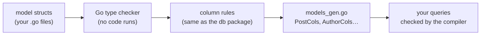

# Code generation

Queries in Anetos name columns with typed Go values, such as
`PostCols.Title`, that `anetos gen` writes from your model structs. The
compiler checks every column name and every value's type, and nothing
has to look a column up at query time.



## Why generate columns

A query builder has to know which column a condition is about. There are
three ways to say it:

- **Strings**, `db.C("title")`: a typo or a renamed column shows up only
  when the query runs, and nothing checks the value's type.
- **Reflection at query time**: inspect a struct or a field pointer on
  every call to find the column. That costs time on every query, and
  Anetos inspects types only at startup, never per query or request.
- **Generated values**: `PostCols.Title` is a `db.Column[string]`, so
  `PostCols.Title.Eq(42)` doesn't compile, a renamed field breaks the
  build, and *go to definition* works.

Go can't refer to a struct field as a value, so these values have to be
written out. `anetos gen` writes them, so you don't. Strings remain
available (`db.C`), as do hand-declared columns (`db.Col[int]("views")`).

Generated columns don't replace the `db` package's own model metadata.
That package still reads each model's fields and tags once per type,
caches them, and uses them to scan rows. The generator and the runtime
apply the same column rules, and a test in the framework checks that
they agree on a fixture with every kind of field.

## What `anetos gen` reads

`anetos gen` loads your packages with the Go type checker
(`golang.org/x/tools/go/packages`). It never runs your code, and it
lives in the `cli` module, so the core module doesn't depend on it.

It only type-checks packages that could have models: those that import
`db` (directly or not), mention `TableName` or a `//anetos:` directive,
or already have a `models_gen.go`. It reads the package as if its
current `models_gen.go` were empty, so a stale file can't get in the
way. Compile errors elsewhere, such as code using a column you haven't
generated yet, don't stop it. Syntax errors and errors in a model's field
types do.

## What counts as a model

A package-level struct is a model when it:

- embeds `db.Model`, `db.Timestamps` or `db.SoftDeletes`, at any depth;
- has a `TableName() string` method; or
- has `//anetos:model` in its doc comment.

`//anetos:skip` leaves a struct out. These rules cover the usual models
without annotations, while request structs and other DTOs next to them
aren't picked up. Models must be in files without build constraints, so
the output is the same whichever platform runs the generator.

## What it writes

One `models_gen.go` per package, declaring `<Model>Cols` for each model
(`postCols` for an unexported `post`). It is an anonymous struct with one
`db.Column[T]` per column, where `T` is the field's type, pointers
included:

```go
// illustrative (an excerpt of examples/database/models_gen.go)
var PostCols = struct {
	ID          db.Column[int64]
	Tags        db.Column[[]string]
	PublishedAt db.Column[*time.Time]
}{
	ID:          db.Col[int64]("id"),
	Tags:        db.JSONCol[[]string]("tags"),
	PublishedAt: db.Col[*time.Time]("published_at"),
}
```

A nullable column is a `Column[*time.Time]`: compare with `new(t)`, and
`Set(nil)` writes NULL. A field tagged `db:"tags,json"` gets
`db.JSONCol`, which encodes the values you pass as JSON; `db.Pluck`
decodes them. `Of(table)` qualifies a column for joins.

The generator only replaces or removes files that start with its
`// Code generated by anetos gen. DO NOT EDIT.` header, and removes
`models_gen.go` from a package with no models left.

## Plain Go that you commit

The generated file is ordinary Go: declarations only, readable, with no
license header, because it belongs to your app. Commit it. The `anetos` tool is a Go tool dependency
(`go get -tool`), so each project pins the generator version in
`go.mod`, and the tool adds nothing to your binary.

You rarely run it by hand: `anetos dev` runs it before every build,
`make:model` right after writing the model, and a
`//go:generate go tool anetos gen` line runs it with `go generate`. In
CI, `anetos gen -check` writes nothing and exits with status 1 if any
file is out of date, so a model change without regeneration fails the
build.

## What is deliberately not generated

- **No query or repository code.** `db.Query[Post]`, `db.Find` and the
  rest are generic functions; the generator adds only column values.
- **No scanning code.** The `db` package scans with its cached metadata.
- **No migrations.** Tables come from migrations you write with the
  schema builder; `anetos make:migration` gives you a starting file.
- **No loading code.** `PostRels` holds one handle per relation field
  (`db.RelOf[Post, User]("Author")`); `With` and `db.Load` do the loading
  at runtime.

> **Coming from Laravel?** Eloquent resolves `where('title', …)` by
> string at runtime. Here the names are generated Go values, so a typo
> breaks the build instead of a request.

## Related

- [Generate typed columns](../guides/code-generation.md)
- [`anetos gen` reference](../reference/anetos-gen.md), [Models reference](../reference/models.md)
- [The data layer](data-layer.md), [One binary](commands.md)
