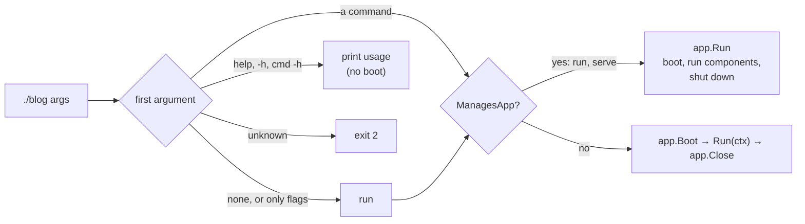

# One binary

Your app builds to one binary that is both the server and its
maintenance tool. `app.Execute()` reads the first argument and runs that
command: `run` by default, or `serve`, `migrate`, `routes:list` and
commands of your own. Code generation lives elsewhere, in the `anetos`
developer tool, because it writes source code rather than running the app.



## Where commands come from

There is no global registry. Commands are registered on the `App`, by the
code that wires the part they belong to:

| Command | Registered by |
|---|---|
| `run [--only=role,…]` (the default), `help` | Every app |
| `serve`, `routes:list` | `web.NewServer` |
| `migrate`, `migrate:rollback`, `migrate:reset`, `migrate:fresh`, `migrate:status`, `db:seed`, `search:reindex` | `migrate.ForApp` ([Migrations](../guides/migrations.md), [Search](../guides/search.md)) |
| `cache:clear` | `cache.ForApp` ([Cache values](../guides/cache.md)) |
| `queue:failed`, `queue:retry`, `queue:forget`, `queue:flush`, `queue:clear` | `queue.ForApp` ([Queues](../guides/queues.md)) |
| `pubsub:publish` | `pubsub.ForApp` ([Pub/sub listeners](../guides/pubsub.md)) |
| `schedule:list`, `schedule:run` | `schedule.ForApp` ([Scheduling](../guides/scheduling.md)) |
| `rbac:roles`, `rbac:user`, `rbac:assign`, `rbac:unassign` | `rbac.ForApp` ([Roles and permissions](../guides/roles-and-permissions.md)) |
| Your own | `app.Command` or `app.AddCommand` |

So a binary only offers commands for what it actually set up: without
`migrate.ForApp`, `./blog migrate` is an unknown command. Registering one
name twice is an error.

```go
// illustrative
app.Command("reports:send", "Email the weekly report", func(ctx context.Context, args *cmd.Args) error {
	return reports.Send(ctx, args.Stdout)
})
```

## How a command boots and closes the app

There are two kinds of commands:

- **Commands that manage the app** (`ManagesApp: true`): `run` and
  `serve`. They call `app.Run`, which boots the app, runs the selected
  components until a signal, and shuts down in stages.
- **All others** run between `app.Boot` and `app.Close`. Their context
  comes from `app.Context`, so it carries what the app provides, such as
  the database. `app.Close` runs the shutdown hooks afterwards, even if
  the command panics, so connections are closed.

`help`, `-h`, `<command> -h` and unknown commands are answered before
anything boots. Because `db.Connect` pings the database at boot, not
when it is called, `./blog help` works with no database. Every command
that boots, `routes:list` included, needs the database reachable.

An app runs one command: afterwards it is stopped and can't boot again,
so tests call `app.ExecuteArgs` on a new app each time.

## Signals and exit codes

The command's context is canceled on the first SIGINT or SIGTERM; a
second signal ends the program at once.

| Exit status | When |
|---|---|
| 0 | Success; `help`; `run` or `serve` stopped by a signal (that is how they end) |
| 1 | The command returned an error, including a command other than `run`/`serve` cut short by a signal |
| 2 | Usage errors: an unknown command, a bad flag, an error from `cmd.Usagef` |

Scripts and orchestrators can rely on these codes: a failed
`./blog migrate` in a deploy step exits 1.

## Roles: one binary, several shapes

`run --only=http` runs the components with the `http` role plus those
without roles; `serve` is the same as `run --only=http`. Your own
components get roles with `anetos.Roles`. A role no component has and no
package declared is an error, so a typo in `--only` fails at startup. The same binary can run
the web tier on some machines and background work on others. See
[the runtime supervisor](runtime-supervisor.md).

## The developer tool is a different program

`anetos` (module `anetos.dev/anetos/cli`) runs on your machine,
not on servers. It writes your project's source files and runs the
development loop:

| `anetos` command | Does |
|---|---|
| `new` | Creates a project |
| `dev` | Regenerates, rebuilds and restarts the app on every change |
| `make:handler`, `make:model`, `make:migration`, `make:middleware` | Write new source files; never overwrite |
| `gen` | Writes typed model columns ([Code generation](code-generation.md)) |
| `key:generate` | Prints a new `APP_KEY` line |

The split follows what each needs. The app binary carries your compiled
code, which is what migrating and listing routes need. The tool reads and
writes your source, which only exists on your machine. Added
with `go get -tool`, it is pinned in `go.mod` and adds nothing to the app
binary. `anetos dev` runs the app binary with `run`, or with the
arguments you give after `--`.

> **Coming from Laravel?** Artisan is split in two. `./blog migrate`
> replaces `php artisan migrate` and runs in production;
> `go tool anetos make:model` replaces `php artisan make:model` and runs
> only on your machine. Custom commands are functions registered on the
> app, not classes.

## Related

- [Commands](../guides/commands.md), [Migrations](../guides/migrations.md)
- [`anetos` tool and app commands reference](../reference/cli.md)
- [Application lifecycle](application-lifecycle.md), [Runtime supervisor](runtime-supervisor.md)
- Package docs: `cmd`
