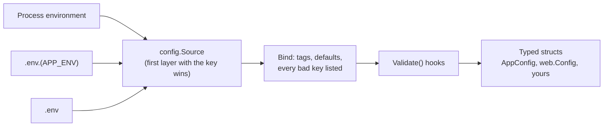

# Configuration

Where settings come from, how they become typed Go structs, and why a bad
setting stops the app before it serves a single request.



## One source, three layers

A `config.Source` answers one question: what is the value of this key?
`anetos.New` builds it with `config.Load`, which consults, highest priority
first, the process environment, then `.env.<APP_ENV>` (such as
`.env.development`), then `.env`. `APP_ENV` itself comes from the
environment, else from `.env`. Missing files are fine, so production can
rely on the environment alone; a file that can't be parsed stops startup
with its name and line. `app.Source()` hands the same source to every
package; `anetos.WithSource` replaces it.

`anetostest.New` doesn't use the settings in `.env`, so your development
database can't leak into tests (it only looks at `.env`'s `DB_CONNECTION`,
to stop a test that would use SQLite by mistake). It forces `APP_ENV=testing` and a random `APP_KEY` over
the process environment, and reads `.env.testing` below it.

## From strings to typed structs

`config.Get[T]` (or `config.Bind`) reads a struct's tags at startup and
converts each value to the field's type: numbers, booleans, durations,
comma-separated slices, pointers, and types with an `UnmarshalText` method.

```go
// illustrative
type MailConfig struct {
	Host    string        `env:"HOST,required"`
	Port    int           `env:"PORT" default:"587"`
	Timeout time.Duration `env:"TIMEOUT" default:"10s"`
}

type Config struct {
	Mail    MailConfig  `prefix:"MAIL_"`         // MAIL_HOST, MAIL_PORT, MAIL_TIMEOUT
	Archive *MailConfig `prefix:"ARCHIVE_MAIL_"` // stays nil unless an ARCHIVE_MAIL_* key is set
}

cfg, err := config.Get[Config](app.Source())
```

A key set to the **empty string counts as unset**: the default applies and
`required` fails, so a blank line copied from `.env.example` can't break a
number. An empty value still hides the layers below it: an empty
`MAIL_PORT` in the environment means `587`, not the value in `.env`.

## Validation at startup

Binding collects **every** missing required key and every value that
doesn't parse, one `*config.FieldError` each
(`config: DB_PORT (Config.Port): invalid integer "abc"`), and returns them
together. If binding succeeded, structs that implement `config.Validator`
check what tags can't express, such as ranges and combinations: nested
structs first, the outer one only if they passed. The framework's own
hooks also report all their problems at once, but a parse error hides hook
problems until the next run.

## Each package reads its own keys

Framework settings are ordinary structs bound from `app.Source()`, each
when you call its constructor:

| Constructor | Loader | Keys |
|---|---|---|
| `anetos.New` | (built in) | `APP_*`, `LOG_*` into `anetos.AppConfig` |
| `web.NewServer` | `web.LoadConfig(src)` | `HTTP_*` |
| `db.Connect` | `db.LoadConfig(src, "")` | `DB_*` |
| `session.ForApp` | `session.LoadConfig(src)` | `SESSION_*` |

So an `HTTP_*` mistake is reported by `web.NewServer`, still before
`app.Run`. `db.LoadConfig(app.Source(), "ANALYTICS_")` reads
`ANALYTICS_DB_URL` and friends for a second connection.

## Secrets

`APP_KEY` is 32 random bytes written as `base64:…`; it encrypts session
cookies. A malformed key fails `anetos.New`; a missing one fails
`session.ForApp`. `APP_PREVIOUS_KEYS` lists old keys that still decrypt,
so you can rotate the key without logging everyone out. Both have the type
`anetos.Secret`, which prints, logs and encodes as `[redacted]`: logging
`app.Config()` doesn't leak the key, and `string(cfg.Key)` gets the value.

`db.Config` keeps `DB_PASSWORD` and `DB_URL` in plain strings (drivers
need them as they are), but its `String` and `LogValue` methods mask the
password in both, so printing or logging the struct doesn't leak them. Your own
secrets belong in `anetos.Secret` fields.

## Environments

`APP_ENV` is `development`, `testing`, `staging` or `production`; anything
else stops startup. It defaults to **`production`**, so a forgotten
setting gets the strictest behavior.

| Behavior | Depends on `APP_ENV` |
|---|---|
| Log format, when `LOG_FORMAT` is empty | JSON in production, text elsewhere |
| `APP_DEBUG=true` | Rejected in production |
| HSTS header | Production only |
| Secure session cookies, when `SESSION_SECURE` is unset | Off in development and testing |
| Query log, when `DB_LOG_QUERIES` is unset | On in development only |
| `migrate:fresh` | Development and testing only |

## Design notes

- **No `config("app.name")` lookups.** A misspelled key fails at compile
  time or startup, never as a silent empty string. The cost is wiring: you
  pass config values to the code that needs them.
- **Environment variables first.** Platforms set them and secrets stay out
  of the repository; `.env` is a local convenience. The limit is a flat
  namespace of strings, with comma-separated lists and no maps.
- **Fail fast.** A wrong value shows up at deploy time, not when a rarely
  used code path first reads it. The cost: one invalid setting stops the
  whole app, and a new value needs a restart.

> **Coming from Laravel?** The struct replaces `env()` plus
> `config/*.php`, and there's no config cache to clear. `APP_KEY` and
> `APP_PREVIOUS_KEYS` play the same roles.

## Related

- [Configure your application](../guides/configuration.md)
- [Configuration reference](../reference/configuration.md), including
  [struct tags](../reference/configuration.md#struct-tags) and
  [load order](../reference/configuration.md#load-order)
- [Test settings](../reference/anetostest.md#settings),
  [rotating the key](../guides/sessions.md#rotate-the-key)
- [Application lifecycle](application-lifecycle.md)
