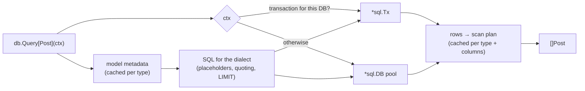

# The data layer

How the db package finds its connection, turns method calls into SQL, and
why it works the way it does.

## The connection travels in the context

`db.Connect` puts the `*db.DB` in every context the app creates, and
`db.Tx` returns a context that also carries a transaction. Every query
function takes a `context.Context` and looks both up:

- no database in the context: `db.ErrNoDB`;
- a transaction for that database: the query runs in it;
- otherwise: the connection pool.

This is why a handler can call `db.Find[Post](c, id)` with only its
request context, and why a function called inside `db.Tx` joins the
transaction without being told. The context already had to be passed for
cancellation and deadlines; the database rides along. For a second
database, `db.WithDB(ctx, other)` switches the target explicitly.

## Types in, SQL out

Models are plain structs. The first time the package sees a type, it reads
its fields and tags once (columns, key, timestamps, soft deletes) and
caches the result; the same happens for each combination of result type
and result columns when scanning. Per query, only values are copied: no
tag parsing and no type inspection.

Conditions are values built from typed columns (`db.Col[int]("views")`),
so `views.Eq("ten")` is a compile error. The builder writes SQL for the
database's **dialect**: `$1` or `?` placeholders, `"quoted"` or
`` `quoted` `` identifiers, `RETURNING` or `LastInsertId`, `ON CONFLICT`
or `ON DUPLICATE KEY`. Values always travel as parameters, never inside
the SQL text.

Queries are immutable: every method returns a new query, so a base query
can be shared and extended without surprises.

## Drivers are separate modules

The dialects live in the core `db` package; the driver modules
(`drivers/sqlite`, `drivers/postgres`, `drivers/mysql`) only pair a
dialect with a `database/sql` driver and build connection strings. An app
downloads and compiles only the drivers it imports. The SQLite driver is
pure Go, so the single binary still cross-compiles without a C toolchain.

Every driver module runs the same conformance suite (`db/dbtest`) against
a real database in CI.

## Times are UTC

Timestamps are written in UTC with microsecond precision, and times are
read back in UTC on every database, so a value round-trips exactly and
compares the same way everywhere. Every time argument is converted to UTC
before it is sent, and the drivers run their sessions in UTC (PostgreSQL
`timezone`, MySQL `time_zone`), so `CURRENT_TIMESTAMP` defaults and
`timestamp`/`DATETIME` columns without time zone agree with the app. On
SQLite, which stores times as text, times are written in the format of
its own `CURRENT_TIMESTAMP`, so text comparison and sorting match time
order. One consequence: a date is a time at midnight, so build dates in
UTC to keep their calendar day.

## What it deliberately doesn't do

- **No lazy loading.** Go can't intercept field access, and hidden queries
  are how N+1 bugs happen. Relations and explicit eager loading
  (`With(...)`) arrive in v0.1.x.
- **No dirty tracking.** `db.Update` writes every column; mass updates set
  exactly the columns you name.
- **No magic zero values.** A NULL in a non-pointer field is an error, not
  a silent empty string.
- **No hidden SQL dialect.** Raw SQL is sent as written (apart from
  placeholders), so you can use each database's features.

## Guarantees

- Nested `db.Tx` calls use savepoints: an inner failure undoes only the
  inner work.
- `db.AfterCommit` callbacks run once, after the outermost commit, and
  never for rolled-back work.
- A `*db.DB` is safe for concurrent use. A transaction is one connection:
  run its queries one at a time.

## Related

- [Connect to a database](../guides/database.md), [Migrations](../guides/migrations.md)
- [Define models and save data](../guides/models.md)
- [Query data](../guides/queries.md)
- [Transactions](../guides/transactions.md)
- [Raw SQL](../guides/raw-sql.md)
- [Models reference](../reference/models.md), [Query builder reference](../reference/query-builder.md)
