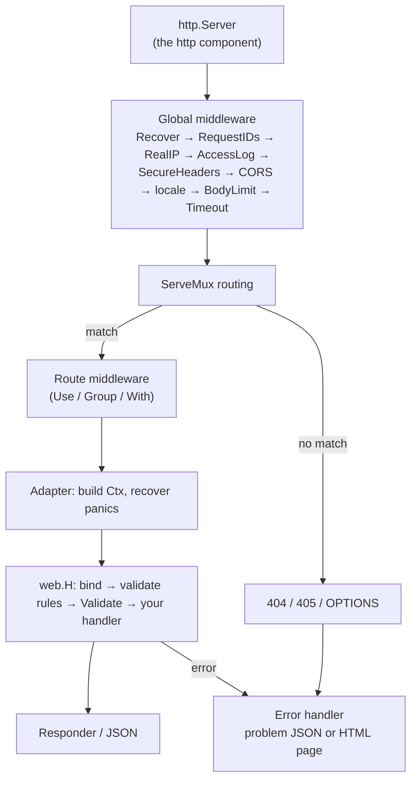

# HTTP request lifecycle

What happens between a request arriving and a response leaving, and where
your code can hook in.

## 1. The server

`web.NewServer(app)` creates an `http.Server` wrapped as a supervised
component (role `http`, stage `StageIngress`, `StopOnFailure`). It listens
when `app.Run` starts and is **ready** once the port is bound; `/health/ready`
reports the whole app's readiness.

On shutdown the server is canceled **first** (see
[Runtime supervisor](runtime-supervisor.md)). It stops accepting
connections and gives in-flight requests a **grace period**
(`HTTP_SHUTDOWN_GRACE`, at most half of `APP_SHUTDOWN_TIMEOUT`). Request
contexts stay alive during the grace period; afterwards they are canceled
and the remaining connections are closed, so a stuck request can't eat the
time workers and hooks need. Long-lived handlers (server-sent events) should
also watch `srv.Stopping()` and end right away.

## 2. Global middleware

Every request, matched or not, passes through the global middleware:

| Middleware | Does |
|---|---|
| `Recover` | Last-resort panic catcher for middleware (handler panics are handled later, with more context) |
| `RequestIDs` | Reuses a safe incoming `X-Request-ID` or generates one; returned in the response and attached to logs |
| `RealIP` | Determines the client IP, trusting forwarding headers only from `HTTP_TRUSTED_PROXIES` |
| `AccessLog` | One structured log line per request (`health.*` routes at debug level) |
| `SecureHeaders` | `nosniff`, frame and referrer policies; HSTS in production |
| `CORS` | Only if `HTTP_CORS_ORIGINS` is set; answers preflights |
| `BodyLimit` | Caps the body at `HTTP_MAX_BODY` |
| `Timeout` | Puts a deadline of `HTTP_REQUEST_TIMEOUT` on the request context; a streaming handler lifts it with `web.WithoutTimeout` (as `c.Events()` does), keeping the cancellation when the client leaves |

## 3. Routing

Routes live on a standard `http.ServeMux`, so matching follows Go's rules:
the most specific pattern wins, and conflicting patterns panic at
registration. A catch-all route produces 404, 405 (with `Allow`) and
automatic `OPTIONS` responses.

## 4. Handler

The router builds a `*web.Ctx`, which is also a `context.Context`, and runs
your handler. `web.H` handlers first **bind** the input (body, then query,
header and path), then check its **validation rules** and run its
**Validate** method. The bind and validation plans are computed at startup,
so each request only copies and checks values; tags are never parsed per
request.

## 5. Response or error

A typed handler's result is written by its `Responder` or as JSON. An error
(or a panic) goes to the **error handler**. By default it logs 5xx errors
with the request ID and writes problem JSON or an HTML page, hiding internal
details unless `APP_DEBUG=true`. The HTML page can be the app's own, in
its layout (`Router.ErrorPages`, which `anetos new` sets up); under the
`web.JSONErrors` middleware every error is problem JSON, whatever the
client accepts (an API project has it on every request). Replace the
whole handler with `web.WithErrorHandler`, and reuse
`web.DefaultErrorHandler` for the cases you don't customize.

If a handler already started writing, an error can only be logged. The
response can't be changed any more.

## Design notes

- **net/http all the way down.** The router is an `http.Handler`, routes
  can serve any `http.Handler` (`HandleStd`), and middleware is
  `func(http.Handler) http.Handler`, so you can leave the framework at any
  layer.
- **`Ctx` is a `context.Context`.** Pass `c` straight to the database or
  queue. It belongs to one request: don't keep it after the handler returns.
- **No reflection per request** beyond setting field values; see design
  principle 4.

## Related

- [Routing](../guides/routing.md)
- [Performance](performance.md): what each step costs
- [Handlers and requests](../guides/handlers.md)
- [Configuration reference](../reference/configuration.md#http-server)
