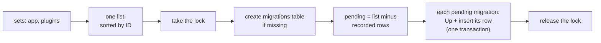

# Migrations

Migrations are Go values compiled into your binary. The runner applies
them in ID order, records each one in the `migrations` table with the
batch it ran in, and wraps each in a transaction where the database
allows it. A database lock keeps two instances from migrating at once.

## Sets and IDs

A **set** (`migrate.NewSet("app")`) is a named list of migrations. Your
app has one; a plugin that ships tables has its own, named after it.
There is no global registry: `migrate.ForApp` receives the sets
explicitly, and two sets with the same name are an error.

Each migration is added under an explicit **ID**, such as
`2026_10_01_120000_create_posts`. The runner merges all sets into one
list sorted by ID as a string, so IDs start with a timestamp, and a
plugin's migrations interleave with yours by date, not by set.

Migrations are Go code, or SQL files embedded with `set.AddFS`, so they
are part of the binary. A deploy ships exactly the migrations its code
expects, and there is no migrations directory to copy to the server.

## The migrations table and batches

Each applied migration is a row in the `migrations` table: its set
(`source`), its ID, its **batch**, and when it ran (UTC). One `migrate`
run applies every pending migration as one batch, so a batch is "what the
last deploy changed". `migrate:rollback` undoes the last batch (or
`--step=N` batches), newest first; `migrate:reset` undoes all of them.

`Up` stops at the first failure. The migrations before it stay applied,
in that batch. A row whose migration is no longer in any set shows as
`Missing` in `migrate:status`, and rollback refuses a batch that contains
one before it undoes anything.

## One transaction per migration

On PostgreSQL and SQLite, a migration's `Up` (or `Down`) and the write to
its row run in one transaction. A migration that fails leaves nothing
behind: fix it and run `migrate` again. There are two exceptions:

- **MySQL** commits every DDL statement immediately, so the runner uses
  no transaction there. A migration that fails halfway leaves its first
  changes in place, and its data changes aren't transactional either.
  Keep MySQL migrations small.
- **Opt-outs.** Some statements can't run in a transaction, such as
  PostgreSQL's `CREATE INDEX CONCURRENTLY`. A migration with a
  `WithoutTransaction()` method, one wrapped in `migrate.NoTransaction`,
  or an SQL file whose first line is `-- anetos:no-transaction` runs
  without one.

## Concurrent runs are safe

During a deploy, several instances may run `./app migrate` at once. `Up`,
`Rollback`, `Reset` and `Fresh` take a lock first:

| Database | Lock | While waiting |
|---|---|---|
| PostgreSQL | `pg_advisory_lock` (advisory locks are per database) | Waits until it is free or the context is canceled |
| MySQL | `GET_LOCK`, named after the database and table | Waits up to 600 seconds, then fails |
| SQLite | A mutex in the process | One server uses the file |

On PostgreSQL and MySQL the lock is held on a dedicated connection, so
the runner refuses a pool of one (`DB_MAX_OPEN_CONNS=1`) there. One instance migrates; the others wait,
then find nothing pending. `migrate:status` and seeders don't take it.

## SQLite and foreign keys

SQLite can't change a column in place. The usual recipe is to create a
new table, copy the rows, drop the old table and rename the new one. With
foreign keys on, that drop would cascade to child tables. So each SQLite
migration runs on a dedicated connection with `PRAGMA foreign_keys = OFF`,
and `PRAGMA foreign_key_check` must pass before it commits.

## The schema builder refuses non-portable changes

A migration that passes on SQLite in development must not fail on
PostgreSQL in production. So the builder returns an error, on every
database, for a NOT NULL column added to an existing table without a
default, `Default(nil)` on a NOT NULL column, and schema-qualified table
names. Operations SQLite can't do (`Change()`, adding or dropping foreign
keys on an existing table) are errors on SQLite, not silent no-ops. Index
names longer than 63 bytes are shortened with a hash, the same way when
created and dropped. `s.Exec` and `s.Dialect()` cover everything else.

## Seeders and the production guard

A seeder (`migrate.Seeder`) is a name and a function, passed with
`migrate.WithSeeders`. Seeders run in the order listed, each in its own
transaction, so a failing seeder rolls back only its own work.

The runner knows `APP_ENV`. In production, `migrate:rollback`,
`migrate:reset`, `db:seed` and `migrate --seed` refuse to run without
`--force`; plain `migrate`, the deploy step, runs as it is, and staging
doesn't need `--force`. `migrate:fresh` drops every table and view, so it runs
only in development and testing, with no override. A runner built with
`migrate.NewRunner` and no `WithEnvironment` option assumes production.

## How `migrate.ForApp` wires it up

`migrate.ForApp(app, sets, opts...)` resolves the `*db.DB` that
`db.Connect` provided (so call `db.Connect` first), builds a runner with
the app's environment and logger, registers the `migrate*` and `db:seed`
[commands](commands.md) on the app, and provides the runner as a
`*migrate.Runner` service, which `anetostest` uses to migrate test
databases.

> **Coming from Laravel?** Batches, `--step`, `--seed` and `--force` work
> like Artisan's. The difference is discovery: migrations are added to a
> set in code, not found in a directory at runtime.

## Related

- [Migrations](../guides/migrations.md), [Seed the database](../guides/seeders.md)
- [Migrations reference](../reference/migrations.md)
- [One binary](commands.md), [The data layer](data-layer.md)
- Package docs: `db/migrate`
