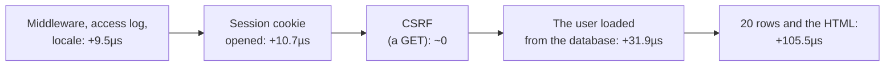

# Performance

What a request costs in Anetos, where the time goes in a real page, and
how the framework is kept from getting slower. The numbers come from
the repository's benchmarks, with their method and code:
[docs/benchmarks/v0.3.md](../../benchmarks/v0.3.md).

## What a request costs

The reference is the same work written by hand with `net/http` and
`database/sql`. Measured in-process (no network), on a 2-vCPU cloud
machine, Go 1.27:

| Work | By hand | Anetos router | Anetos server (default middleware) |
|---|---|---|---|
| Hello world | 4.0µs | +0.6µs | +3.0µs |
| JSON in, bound and validated, JSON out | 6.7µs | +1.3µs | +4.1µs |
| One row by key from SQLite, as JSON | 19.1µs | +6.3µs | +13.7µs |

The router and typed handlers ([`web.H`](../guides/handlers.md)) cost
about a microsecond, as much as chi, Gin or Echo doing the same work.
The server's middleware (recover, request IDs, client IP, security
headers, body limit, timeout) costs about 3µs; with a database the
timeout's context costs more, since `database/sql` watches it with a
goroutine per query. `db.Find` costs about 5µs over a hand-written
query and scan, and a list of 20 rows the same few microseconds.

## Where a page's time goes

The page an app made with `anetos new` and `make:auth` serves to a
signed-in user, with 20 rows from SQLite:

Each step is what that part adds to the one before (a hello route
served with more and more of the stack, then the page). The page takes
about 160µs in all, most of it in the two queries: the list's query
alone takes 72µs and writing its HTML 3.6µs. That is on SQLite in
memory, the fastest database a request can reach; with PostgreSQL or
MySQL over a network, each query also waits a round trip, often 100µs
or more, and the framework's share shrinks further. What helps most:

- **Make fewer, simpler queries.** Load related rows with `With` rather
  than in a loop ([Find N+1 queries](../guides/n-plus-one.md)), select a
  page of rows, index what you filter and sort by.
- **Cache what many requests read** ([Cache](../guides/cache.md)).
- **Do slow work after the response:** emails, reports and calls to
  other services belong in [queue jobs](../guides/queues.md).
- **Measure your own app** before optimizing it: Go's benchmarks and
  profiler work on handlers served in-process, as `bench/` does, and on
  tests made with [anetostest](testing.md).

## How Anetos stays fast

The rules the code follows:

- **No reflection per request.** Binding plans, validation rules, routes
  and models' columns are worked out once, at boot or first use.
- **One context value per request** for the router's state, which
  holds the request ID, the client's address and the locale, rather
  than a context and a copy of the request per middleware.
- **Nothing done twice.** A session notes its changes as they happen
  and is written back only if something changed; the keys of recent
  encrypted messages (a session cookie the browser sends again) are
  cached; row scanners are reused from row to row.
- **No pooling where it would bite.** Render buffers are pooled;
  `web.Ctx` isn't, so a handler that keeps one never sees another
  request's.

And the checks that keep them:

- **Allocation budgets.** The allocations a request or query makes
  beyond the hand-written work are counted by a test
  (`bench/budget_test.go`) in every CI run: growing them fails it, so a
  change that needs more must say why. (The page's parts are counted in
  all, with some headroom for differences between Go releases.)
  Allocations, unlike times, are the same on every run.
- **Pull requests are compared with their base.** The CI builds the
  benchmarks of both and runs them in turns on one machine; more
  allocations, or a median more than 20% slower with every sample
  slower, fail the check (`make bench-compare` does it locally); the
  label `benchmark-ok` accepts a regression that is worth it.

## Related

- [Benchmarks: results, method and analysis](../../benchmarks/v0.3.md)
- [HTTP request lifecycle](http-request-lifecycle.md)
- [Data layer](data-layer.md)
- [Find N+1 queries](../guides/n-plus-one.md)
