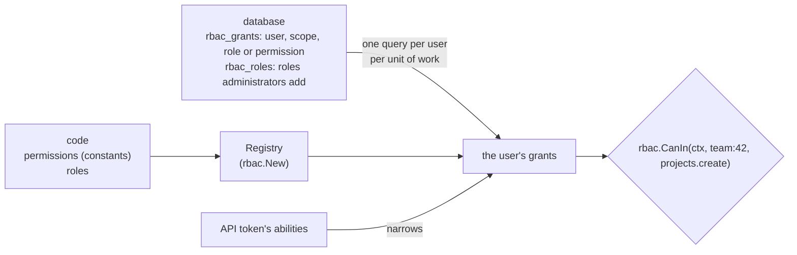

# Roles and permissions

How package `auth/rbac` decides what a user may do, and where it keeps
what it needs.

## Permissions in code, grants in the database

Permissions are what the code checks, so they live in the code: typed
constants, declared once and passed to `rbac.New`. A misspelled
constant doesn't compile, and checking a permission that isn't declared
(a string, say) is reported as a bug (an error, a 500), never as a quiet
"no".

Roles are sets of permissions. Those the app is built around (owner,
member, admin) are declared in code too, and need no syncing: they're
not in the database. Administrators can add their own at run time,
stored in `rbac_roles`, but only from declared permissions: a role of
the database can't invent a permission the code doesn't check, and only
code can declare a super role, which has every permission. A role
removed from the code allows nothing to those who still have it
(`rbac:roles` lists them), and creating a role of the database with its
name takes it from them first, so it doesn't come back to life. A role
declared in code replaces a stored one of the same name.

Who has what is data: `rbac_grants` holds one row per user, scope and
role (or single permission). A user is identified by the `AuthID` of
package `auth`, so any user type works, and the tables don't reference
the users table. User IDs and scopes compare exactly on every database:
on MySQL and MariaDB, whose text comparisons ignore case, accents and
trailing spaces, the columns are binary.

## Scopes

Every grant has a scope: global, or one such as `team:42`, made by
`rbac.ScopeOf(kind, id)`. A grant applies in its scope only, except a
global one, which applies in every scope: an administrator is an
administrator in every team. There is no hierarchy of scopes (an
organization above its teams); give the role in each scope, or globally.

A scope is just a key, so a team's members need no table of their own:
they're the users with a role in its scope, and a user's teams are the
scopes of kind `team` they have a grant in. Nor does it know whether the
team exists: grants in a team's scope apply to whichever team has its
ID, so give them only in existing teams, and remove them
(`rbac.RemoveScope`) when a team is deleted.

## When grants are read

A user's grants (every scope's) are read in one query, two when they
have roles of the database, the first time a request, a job, a listener
or a tool call checks them, and kept until it ends: a page that checks a
dozen permissions in a dozen teams queries once. A unit started inside
another (a tool call in a request, a job run synchronously) shares them.
Changes made through the package in that unit of work are seen at once;
others are seen by the next one. What a transaction reads is kept only
once it commits, so a rolled-back grant never lingers; checks inside a
transaction read each time, so check before a loop that runs in one. Outside a unit (a
command, a test's own context), every check reads again. This suits users with grants in up to a few thousand
scopes; staff who see everything get a global role instead of one in
each team.

## Who asks

The package functions (`rbac.Can`, `rbac.AuthorizeIn`, `rbac.Require`…)
check the request's signed-in user, as package `auth` finds them, in the
context. Anything that has the request's context can ask: handlers,
templates, policies, and the tools an AI model calls, which run with the
context of the call, so a model can't do more than its user. Jobs and
other code without a signed-in user check a user by ID: `rbac.Of(ctx,
id)`.

A request signed in with an API token may use only the permissions that
are also the token's abilities (a token with `*` has its user's). A
permission's name is the ability, so a token made with
`projects.view` can view projects, whatever roles its user has. Role
checks (`rbac.HasRole`, `Grants.Roles`) see no roles for a token without
`*`, since a role says nothing about what the token was given; gate
actions with permissions.

## Giving roles safely

A user who may manage a team's members could give a role with more than
they have. `rbac.AuthorizeRole(ctx, scope, role)` refuses unless the
signed-in user has, in that scope, every permission the role allows (and
is super there, for a super role): an owner can make owners, not
administrators. `rbac.AuthorizeRolesOf(ctx, scope, userID)` applies the
same rule to the roles someone has, before changing or removing them, so
a user who may manage members can't demote an owner unless they could
make one. Neither replaces the check that the user may manage members at
all, which is one of the app's permissions. Both compare permissions,
not names: a role without permissions is anyone's to give, so gate
actions with permissions, not role names.

## Roles or policies

Policies (`auth.Authorize`) decide from the thing acted on: an author
edits their own posts. Roles decide from who the user is: an editor
edits every post in the team. Apps use both, and a policy can ask about
roles: `return p.AuthorID == u.ID || rbac.CanIn(ctx, teamScope(p.TeamID), EditPosts)`.

## Not in scope

Hierarchies of scopes, roles inheriting from roles, permissions with
wildcards, roles that one team defines for itself, and denying a
permission a role allows are out of scope.

## See also

- [Roles and permissions](../guides/roles-and-permissions.md)
- [Authentication and authorization](authentication.md)
- [Authentication reference](../reference/auth.md#roles-and-permissions)
