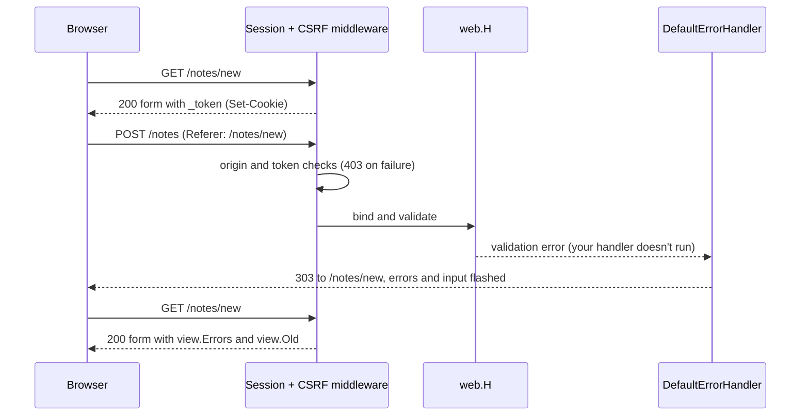

# Server-rendered HTML

How pages are rendered, how a visitor's state travels in an encrypted
cookie, and how a failed form finds its way back to the page it came from.

## Pages are components

A component is anything with `Render(ctx context.Context, w io.Writer)
error` (`view.Component`). templ generates that method, so the core
doesn't depend on templ. `view.Template` adapts `html/template`, and
`view.ComponentFunc` a function:

```go
// illustrative
hello := view.ComponentFunc(func(ctx context.Context, w io.Writer) error {
	_, err := io.WriteString(w, "<p>Hello</p>")
	return err
})
return c.Render(http.StatusOK, hello)
```

`c.Render` (and `web.View`) renders into a buffer with the `*web.Ctx` as
`ctx`, and writes the page only when the component has finished. So a
render error, such as an unknown route name in `web.URL`, becomes an error
page, never half a page. And because the session is saved when the
response starts, a CSRF token that `view.CSRFField` creates during the
render still reaches the cookie. Helpers read the router and the session
from `ctx`; `view.Template` gets no context, so pass what it needs in data.

## The session is the cookie

The session middleware decrypts the cookie when a request arrives and
writes it back when the response starts. The cookie holds a random ID, the
CSRF token, when the session started and was last used, your values (as
JSON), and the flash data. It is sealed with AES-256-GCM under a key
derived from `APP_KEY` for every write (HKDF-SHA256, random salt), with the
cookie name authenticated alongside. A cookie that doesn't decrypt, or has
expired, starts an empty session.

- **Lifetime.** Expiry is checked against the times inside the cookie, so
  a replayed cookie can't outlive it: `SESSION_LIFETIME` (2h) idle, and
  `SESSION_MAX_LIFETIME` (7 days) in all, restarted by `Regenerate` and
  `Invalidate`.
- **Writes.** No cookie until something is stored; then a write when the
  session changes, and at most every tenth of `SESSION_LIFETIME` to keep
  it alive.
- **Attributes.** `HttpOnly`, `SameSite=Lax`, and `Secure` outside
  development and testing. A Secure cookie without `SESSION_DOMAIN` and
  with path `/` is named `__Host-anetos_session`, so a subdomain can't
  plant one.
- **Key rotation.** Each cookie records its key. Old keys in
  `APP_PREVIOUS_KEYS` still decrypt, and the cookie is re-encrypted with
  `APP_KEY` on its next write. Renaming the cookie, or switching Secure
  (which adds or drops `__Host-`), ends every session.

**Flash data.** `s.Flash(key, v)` is readable for the rest of this request
and during the next one; saving that request drops it (`Keep` and
`Reflash` extend it). Field errors and old input are stricter:
`view.Errors` and `view.Old` return only what the *previous* request
flashed, for one request.

## The form round trip



When a request other than GET or HEAD fails validation (422, or 400 with
field errors), `web.DefaultErrorHandler` redirects back if the request
comes from a browser (`Sec-Fetch-Mode: navigate`, or `Accept` listing
`text/html`), isn't htmx (unless boosted), and has a session. It flashes
the errors in order and the posted values, minus `_method` and fields whose
names contain `password`, `secret` or `token`. The 303 goes to the
`Referer` if it is on this site, else `/`: the session doesn't track pages.
JSON clients and htmx get the 422.

## CSRF protection

`web.CSRF` checks every method except GET, HEAD, OPTIONS and TRACE in two
layers. First, Go's `http.CrossOriginProtection` rejects requests the
browser marks as cross-site (`Sec-Fetch-Site`, or an `Origin` that isn't
this host); requests with neither header pass. Then the `_token` field or
`X-CSRF-Token` header must match the session's token, which is masked with
a fresh random pad at every render so compressed pages never repeat it
(BREACH). Both failures are **403**. `Regenerate` replaces the token.

## Method override, assets and htmx

- **`web.MethodOverride`** runs globally, before routing picks a route by
  method: a POST with `_method` of PUT, PATCH or DELETE, in the query or a
  URL-encoded body (restored afterwards), is routed with that method.
  Multipart bodies aren't read; put `?_method=PUT` in the action.
- **`view.NewAssets`** hashes every file once, at startup. `assets.URL`
  adds `?v=<hash>`; the current hash is cacheable for a year, anything else
  revalidates (`no-cache`, `ETag`).
- **htmx** is bundled (`htmx.FS`), so there's no JavaScript build step.
  `c.IsHTMX()` adds `Vary: HX-Request`, and a layout sends the token with
  `hx-headers` and `view.CSRFToken`.

## Guarantees and trade-offs

- **Unreadable and unforgeable**, as long as every instance shares `APP_KEY`.
- **Not revocable.** `Invalidate` empties the session in this browser; a
  copied cookie works until its idle or absolute expiry.
- **About 4 KB.** If the session doesn't fit, a failed form's input is
  dropped first (logged; errors stay), then the save is skipped (logged).
  Store IDs, not records.
- **Changes after the response starts are lost**, as when streaming.
- **Kept out of shared caches:** `Cache-Control: private` (unless you set
  one) and `Vary: Cookie`.
- **Why cookies in v0.1:** no store to run, configure or clean up, and any
  instance serves any request. Server-side stores, which can revoke
  sessions, arrive with the v0.2 drivers.

> **Coming from Laravel?** This is the `cookie` session driver, always
> encrypted. `@csrf`, `old()` and `$errors` map to `view.CSRFField`,
> `view.Old` and `view.Errors`, but a token mismatch is a 403, not a 419.

## Related

- [Render HTML with templ](../guides/views.md)
- [Sessions and flash messages](../guides/sessions.md), [Handle HTML forms](../guides/forms.md)
- [HTTP request lifecycle](http-request-lifecycle.md)
- [Views, sessions and forms reference](../reference/views.md), [Session settings](../reference/configuration.md#sessions)
