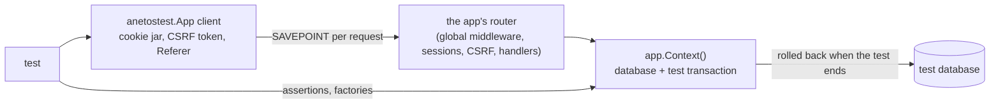

# How testing works

What `anetostest` builds for a test, how it keeps tests from seeing each
other's data, how its client imitates a browser, and where a test run
differs from production.



## The app under test is your app

`anetostest.New(t, setup)` calls the same `setup` function `main` uses to
connect the database and add the server and routes. It then boots the app
(providers run; components such as the HTTP server and workers don't
start), runs the migrations `migrate.New` registered, and closes the app
when the test ends. There is no test-only wiring: `session.New` and
`migrate.New` provide their manager and runner to the app, and
`anetostest` finds them there.

Settings come from these sources, highest priority first: `anetostest.Env`
options; `APP_ENV=testing`, a random `APP_KEY`, and a `CACHE_PREFIX`,
`SESSION_PREFIX`, `QUEUE_PREFIX` and `PUBSUB_PREFIX` of the app's own, and
`MAIL_DRIVER=memory` and `STORAGE_DRIVER=memory`, so emails are kept
rather than sent and files kept in memory; the process
environment; `.env.testing` next to `go.mod`; then `HTTP_ACCESS_LOG=false`,
`APP_URL=http://example.test` (the test client's site) and `MAIL_FROM_ADDRESS=test@example.com`.
Settings in `.env` are never used. With SQLite and no `DB_NAME` or
`DB_URL`, the database is `:memory:`, never the default `database/app.db`.
If the test settings name a database without `DB_DRIVER` while `.env`
sets another `DB_DRIVER`, the test fails rather than create a SQLite
file of that name. The app's logs go to the test's log.

## Database isolation

| Database | Each test gets |
|---|---|
| SQLite in memory (the default) | Its own database, migrated from scratch. No transaction |
| SQLite file, PostgreSQL, MySQL | The shared database, migrated, and a transaction begun in `New` and rolled back when the test ends |

Whether the database is in memory is asked of SQLite after connecting.
The transaction rides in `app.Context()`, and every test request runs with
that context, so handlers, assertions and factories all join it (see
[The data layer](data-layer.md)). Each request also runs inside a
savepoint, `anetostest_request`. If releasing it fails, because a statement
failed and PostgreSQL aborted the transaction, the client rolls back to the
savepoint: that request's writes are undone and the test can go on.

Tests can call `t.Parallel()` with in-memory SQLite and with a database
server. They can't with a SQLite file, where each test's transaction holds
the only write lock. An `App` handles one request at a time: make one per
test or subtest.

## A client that behaves like a browser

Requests go straight to the router with `httptest`, as
`http://example.test/…`, through every global and route middleware.
Nothing listens on a port. The client keeps what a browser keeps:

- **Cookies.** Its jar honors `Path` and expiry, and ignores `Secure` and
  `Domain`, so `SESSION_SECURE` and `__Host-` cookies work over the
  in-process HTTP.
- **The CSRF token.** For every method but GET, HEAD, OPTIONS and TRACE, it
  asks the app's `session.Manager` for a token with `Edit`, which changes
  the session in the jar without counting as a request (flash data stays
  for the real next request), and sends it as `X-CSRF-Token`. An
  `X-CSRF-Token` you set, or a `_token` field in a form sent with the form
  methods, is sent instead. CSRF stays on: tests pass the same checks as
  users.
- **The `Referer`.** The last page it loaded (a GET answered 200 with
  HTML, not an htmx fragment) is sent with the next request, so a failed
  form is redirected back to it, as in
  [Server-rendered HTML](server-rendered-html.md#the-form-round-trip).

Form methods send `Accept: text/html` and JSON methods `application/json`,
so on a route with sessions the same failed validation is a redirect back
for one and a 422 for the other.

## Assertions and factories

Response assertions are methods that report with `t.Errorf` and return
the response, so one request's checks chain and every failure shows at
once, with the start of the body. Session assertions read the session the
next request will carry. Database assertions and `anetostest.Create` are
generic functions (`AssertDatabaseHas[T](app, conds...)`) because Go has
no generic methods; they take the query builder's typed conditions.

Factories (`db/factory`) are values: `factory.New(func(n int) T)`, where
`n` is a sequence number for values that must differ. `With` returns a new
factory, so a shared base can't be changed by one test. Rows are inserted
with `db.Create`, so hooks run. Sequence numbers never reset within a test
binary: check the rows `Create` returns, not "Post 1".

## Where tests differ from production

- **`db.AfterCommit`** callbacks run as if the test's transaction weren't
  there: at once when registered directly in it, and when a `db.Tx`
  inside it commits (a request's, say). With in-memory SQLite there is no
  test transaction, so this is how they always work.
- **Queue workers** use their own connections, so they don't see the
  test's rows. With `QUEUE_DRIVER=sync` (the default) jobs run at once,
  in the request; to run workers, use `WithoutTransaction()`.
- **PostgreSQL errors inside a request.** The savepoint only helps between
  requests. A handler that catches a failed statement and keeps querying
  fails in a test, where production would carry on.
- **Timeouts.** A query canceled by a timeout closes the connection that
  holds the test's transaction (PostgreSQL, MySQL); the test fails.
- **MySQL DDL** commits the test's transaction; the test fails.
- **Other connections.** Code that opens its own connection, or starts
  `db.Tx` on a new context, doesn't see the test's rows and can wait on its
  locks until the test times out.

For these paths, pass `anetostest.WithoutTransaction()`: the test's writes
are committed, and the test cleans up after itself.

```go
// illustrative
app := anetostest.New(t, setup, anetostest.WithoutTransaction())
t.Cleanup(func() { _, _ = db.Exec(app.Context(), "DELETE FROM notes") })
```

## Recording and fakes

A test checks what the app did besides answering: the jobs it
dispatched, the events it emitted, the email it sent and the messages it
published. Rather than swapping these services for test doubles,
`anetostest` watches the real ones: the queue, the event bus, the
mailer and the pub/sub each have an `Observe` hook, which `anetostest.New`
uses at the end of `setup` to record everything. The app runs as it
does in production, so a test of a job's effect and a test of its
dispatch use the same setup.

When a test only wants to know that something was asked for, a fake
stops the side effect: `FakeQueue` keeps jobs from being stored or run,
`FakeEvents` keeps events from reaching their listeners, `FakePubSub`
keeps messages from the broker. Each is a switch on the real service
(`Fake`), so nothing else about the app changes. Email has no fake:
tests never send it (`MAIL_DRIVER=memory`). Language models are the
exception: a test uses the AI client's fake provider
(`AI_PROVIDER=fake`, unless the test sets another), since a model's
answers vary and cost money;
`FakeAI` scripts them, and everything around the model (schemas,
validation, tools) runs for real. Assertions are typed:
`AssertDispatched[ChargeOrder]` decodes the recorded jobs as a worker
would, so it checks what the worker will get.

Async event listeners still use their own connections, like queue
workers: wait for them with `bus.Wait`; see [Queues](../guides/queues.md#5-test)
and [Events](../guides/events.md#5-test).

## Time

The framework reads the time an app can observe from the app's clock
(`anetos.Now(ctx)`, `app.Now()`) rather than `time.Now`: timestamps,
lifetimes and expiries. In production it is the system clock; a test
freezes it (`app.Freeze`) or moves it (`app.Travel`), and everything
that reads it follows, the test client's cookies included. Time kept by
database and Redis servers, timeouts and the loops of workers and the
scheduler are real: a test can't fast-forward a server.

> **Coming from Laravel?** `anetostest.New` is a `TestCase` using
> `RefreshDatabase`: a fresh in-memory database, or migrations plus a
> transaction per test. Unlike Laravel's tests, CSRF isn't disabled; the
> client sends the token.

## Related

- [Test your app](../guides/testing.md), [Seed the database](../guides/seeders.md)
- [Testing reference](../reference/anetostest.md)
- [The data layer](data-layer.md), [Server-rendered HTML](server-rendered-html.md)
- [Transactions](../guides/transactions.md)
