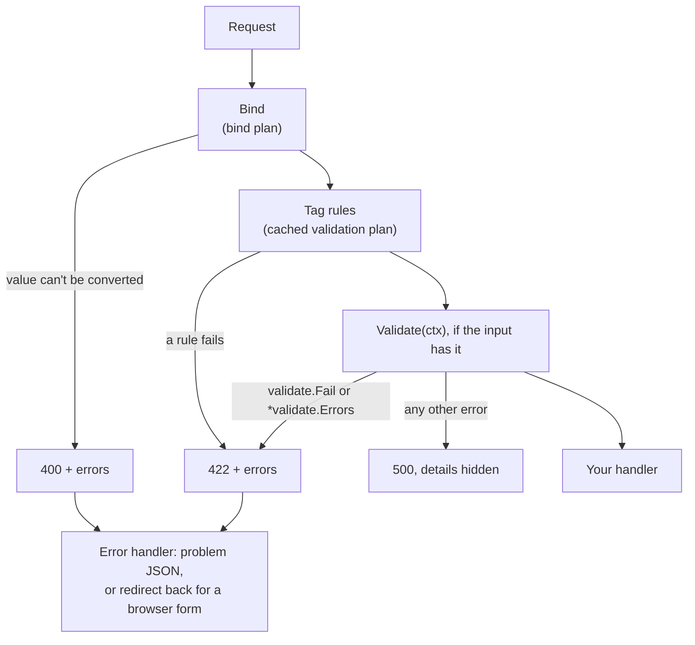

# Validation

How rules in struct tags become a cached plan, what `web.H` does with the
result, and why validation works the way it does.



## Rules are compiled once

Rules use Laravel's syntax: `validate:"required|max:200|in:a,b"`. The first
time a struct type is validated, its tags are parsed into a
`validate.Plan` and cached for the life of the process. For `web.H`, that
happens when the route is added, so tag mistakes are **startup errors**,
not per-request ones: an unknown rule, `min:abc`, `email` on an `int`, a
rule naming a missing field, or a `ValidationMessages` key that matches
nothing. `web.H` panics with the message.

Per request, only the plan runs: messages are built only when a rule
fails, and with the built-in rules valid input is checked without
allocating (maps of structs and file rules excepted). `validate.Struct`
uses the same cache for input that doesn't come from HTTP, such as job
payloads.

## Empty means "not sent"

Only the `required` family (`required`, `required_if`, `required_unless`,
`required_with`, `required_without`) and `accepted` run on an empty field.
Every other rule, custom rules included, passes it. Empty means a nil
pointer, a blank string, an empty slice or map, or a zero struct or array
such as a zero `time.Time`. So a field is optional unless you say
`required`, and needs no `nullable` marker.

Numbers and booleans are **never** empty, because zero can be a real
answer; `required` rejects `0` and `false` in them. A pointer expresses
"not sent":

```go
// illustrative
type UpdateProfile struct {
	Name    string `json:"name" validate:"required|max:100"`
	Website string `json:"website" validate:"url:https"` // optional; checked only when sent
	Age     *int   `json:"age" validate:"min:13"`        // nil passes, 0 fails
	Terms   bool   `json:"terms" validate:"accepted"`
}
```

## The order inside web.H

1. **Bind.** A value that can't be converted (`page=abc`) is a **400**
   listing each bad field. The rules don't run.
2. **Tag rules.** Failures are collected into a `*validate.Errors`, one
   message per field (the first failing rule wins), and returned as a
   **422**. The handler isn't called.
3. **`Validate(ctx)`**, only if the input implements `web.Validator` and
   the tags passed, so it can rely on well-formed input. Use it for checks
   that need the database or several fields. `validate.Fail` or a
   `*validate.Errors` gives the same 422; a `web.HTTPError` keeps its status.
4. **Your handler.**

**Any other error** from `Validate`, or from a custom rule, is a **500**
whose text stays out of the response. A failing database check never
reaches a client as a "validation message".

## One error, two responses

`*validate.Errors` reports status 422 and implements `web.FieldErrorer`.
`web.DefaultErrorHandler` turns it into one of two responses:

- **API clients** get RFC 9457 problem JSON with an `errors` object keyed
  by the request key: the `json` name, else `form`, `query`, `path` or
  `header`, with dotted keys for nested data (`items.0.name`).
- **Browser form posts** (a navigation or `Accept: text/html`, not GET)
  on a route with a session are redirected back to the form's page. The
  errors, keyed by `form` name, and the submitted input are flashed;
  `view.Errors` and `view.Old` read them on the next page. Fields whose
  name contains `password`, `secret` or `token` aren't flashed. A 400 from
  binding with field errors is redirected the same way. htmx requests
  (except boosted ones) get the 422.

A custom error handler keeps the redirect only if it calls
`web.DefaultErrorHandler` for these errors.

## Custom rules and messages

Tags can only name rules, so custom rules live in a registry filled from
`init`, like `sql.Register`:

```go
// illustrative
func init() {
	validate.Register("even", "The {label} field must be even.",
		func(ctx context.Context, f validate.Field) (bool, error) {
			n, ok := f.Value.(int)
			return ok && n%2 == 0, nil
		})
}
```

A rule gets the request context and the field's key, label, value
(pointers followed), parameters and parent struct. Registering a
duplicate or built-in name panics, and so does a route that uses a rule
before it is registered ("unknown rule"). The `db` package registers
`unique` and `exists` this way.

Messages are English, in Laravel's wording. The label comes from the key
(`first_name` becomes "first name") or a `label` tag. A
`ValidationMessages() map[string]string` method replaces templates by
`key.rule` or `rule`; it is read once, when the plan compiles.

## What it deliberately doesn't do

- **No `nullable`, `sometimes` or `bail`.** Empty fields already skip
  non-required rules, and a field stops at its first failure. Using them
  is a startup error that says so.
- **No go-playground syntax.** `required,email` fails at startup.
- **No changes to the input.** Values aren't trimmed; a blank string
  counts as empty but stays as sent.
- **No translations yet.** Messages are English only.

> **Coming from Laravel?** The input struct is your Form Request, and
> `view.Errors` and `view.Old` are `$errors` and `old()`. Unlike Laravel,
> a typo in a rule stops the app at startup instead of failing a request.

## Related

- [Validation](../guides/validation.md), [Handle HTML forms](../guides/forms.md)
- [Handlers and requests](../guides/handlers.md)
- [Validation rules reference](../reference/validation-rules.md)
- [Request binding reference](../reference/binding.md#error-statuses)
- [HTTP request lifecycle](http-request-lifecycle.md)
