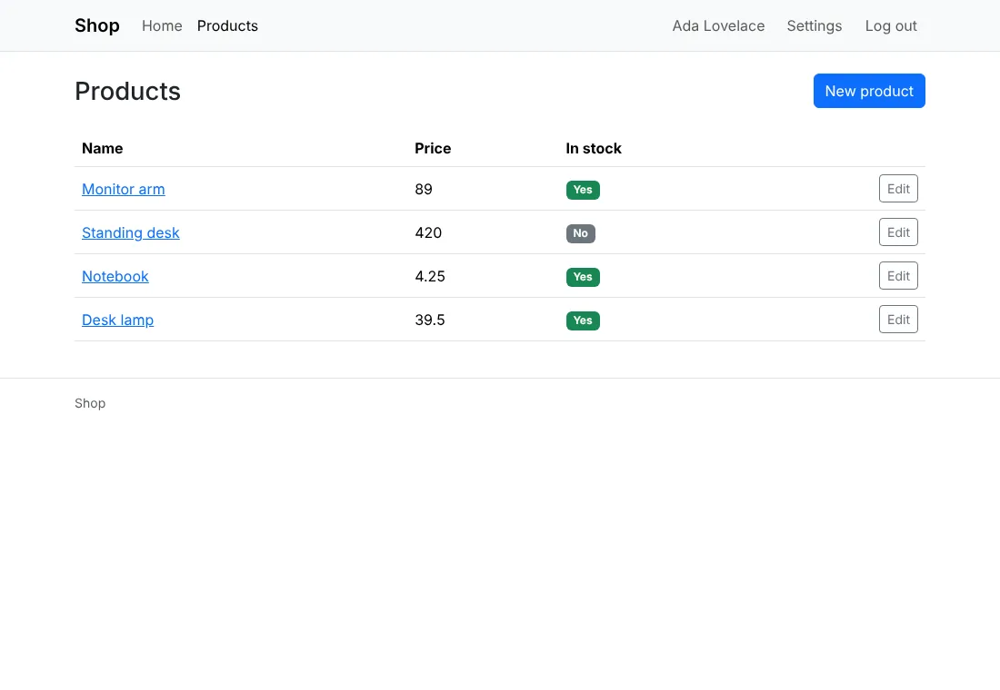
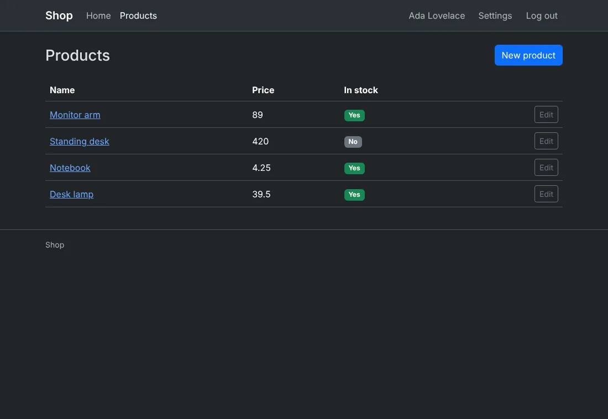
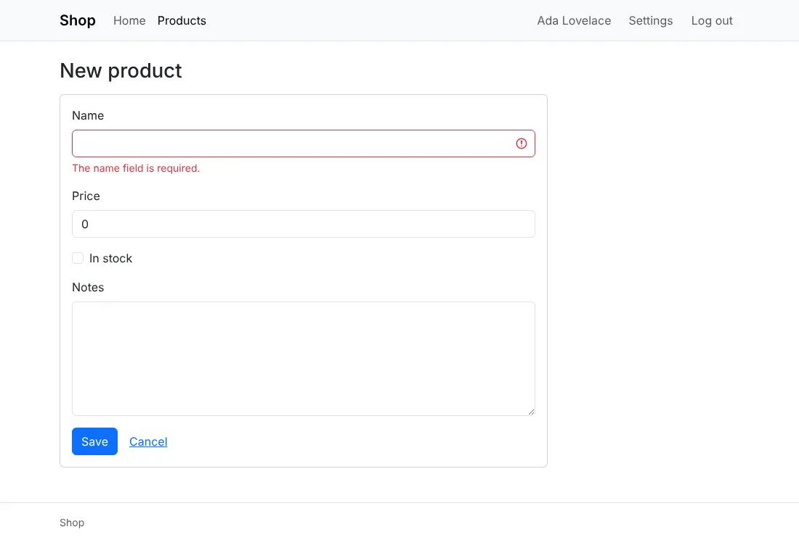
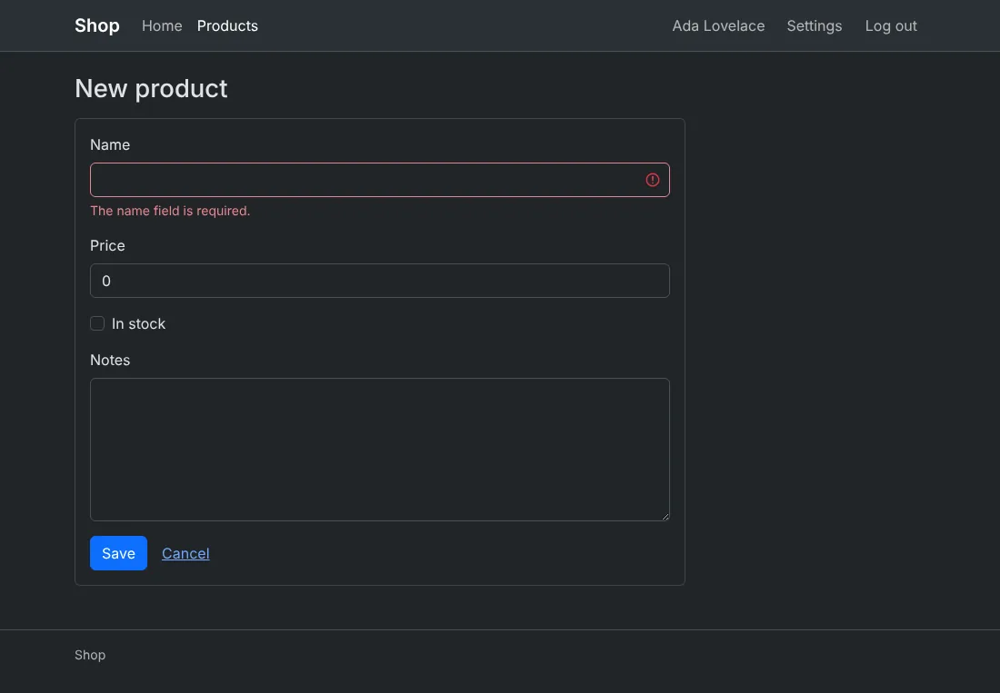
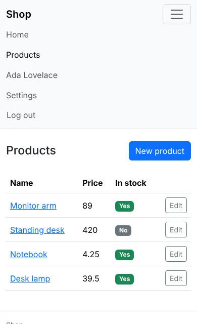

# Style with Bootstrap

`--css=bootstrap`: [Bootstrap](https://getbootstrap.com) 5.3.8's
classes, its stylesheet and its JavaScript bundle, as released. No
build step.





## Before you start

A project made with `anetos new blog --css=bootstrap`, or switched to it
with `go tool anetos css:use bootstrap`.

## Steps

### 1. Know its files

| File | Holds |
|---|---|
| `public/static/bootstrap.min.css`, `bootstrap.bundle.min.js` | Bootstrap as released (the bundle includes Popper), with `bootstrap.LICENSE.txt` and `popper.LICENSE.txt` (MIT) |
| `public/static/theme.js` | Sets `data-bs-theme` on `<html>` from the visitor's light or dark mode, and follows its changes |
| `public/static/app.css` | The few rules Bootstrap has no class for (a narrow column, the login card's width) |
| `views/ui/*.templ` | The components: `navbar`, `card`, `form-control`, `alert`, `badge`, `pagination`… |
| `views/ui/classes.go` | The classes of each variant and size (`btn btn-primary`, `btn-outline-secondary`, `btn-danger`, `btn-link`, `btn-sm`, `w-100`) and tone |

A form with its errors:





On a small screen, a menu button opens the header's links. Its name for
screen readers is `nav.menu` in `locales/<locale>/app.yaml` ("Menu"):



### 2. Change its colors

Bootstrap compiles its colors into each component with Sass; without a
build step, set the CSS variables the components read, in `app.css`:

```css
/* illustrative */
:root, [data-bs-theme=light] {
	--bs-primary: #6f42c1;
	--bs-primary-rgb: 111, 66, 193;
	--bs-link-color: #6f42c1;
	--bs-link-color-rgb: 111, 66, 193;
	--bs-link-hover-color: #59359a;
	--bs-link-hover-color-rgb: 89, 53, 154;
}
[data-bs-theme=dark] {
	--bs-link-color: #a385db;
	--bs-link-color-rgb: 163, 133, 219;
	--bs-link-hover-color: #c2aeea;
	--bs-link-hover-color-rgb: 194, 174, 234;
}
.btn-primary {
	--bs-btn-bg: #6f42c1;
	--bs-btn-border-color: #6f42c1;
	--bs-btn-hover-bg: #59359a;
	--bs-btn-hover-border-color: #59359a;
	--bs-btn-active-bg: #59359a;
	--bs-btn-active-border-color: #59359a;
}
```

[Bootstrap's docs](https://getbootstrap.com/docs/5.3/customize/css-variables/)
list each component's variables. Some colors are compiled in, the
focus ring of the form controls among them: for a full theme (another
palette, fonts, spacing), compile Bootstrap with Sass yourself and replace
`bootstrap.min.css` with the result.

### 3. Use more of Bootstrap

Its JavaScript bundle is loaded on every page (deferred), so its
components work in yours: dropdowns, modals, collapses (tooltips and
popovers need a line of script to start them, as Bootstrap's docs
show). A
dropdown, as a component of `views/ui`:

```templ
// illustrative
templ Dropdown(label string) {
	<div class="dropdown">
		<button class="btn btn-outline-secondary dropdown-toggle" type="button" data-bs-toggle="dropdown" aria-expanded="false">{ label }</button>
		<ul class="dropdown-menu">
			{ children... }
		</ul>
	</div>
}
```

Its grid (`row`, `col-md-6`) and utilities (`mb-3`, `d-flex`) work in
your own pages too; a component keeps them in one place ([Style your
app](styling.md#5-add-your-own-component)).

## How it works

Bootstrap's dark mode is `data-bs-theme="dark"` on `<html>`, which
`theme.js` sets from the visitor's system before the page shows. The
menu button is Bootstrap's collapse, from its bundle. `css:use
bootstrap` in a project that has it brings a newer Bootstrap when a
newer `anetos` carries one ([Style your app](styling.md#8-switch-css-frameworks)).

## Common problems

| Symptom | Cause | Fix |
|---|---|---|
| `--bs-primary` changes nothing on buttons | Each button's color is its own variables | Set `.btn-primary`'s, as above |
| The menu button does nothing | `bootstrap.bundle.min.js` isn't loaded (a `ui.Head` you changed), or JavaScript is off | Link the bundle from `ui.Head`; without JavaScript, the links stay hidden on small screens |
| The browser's console reports a missing `.map` file | The released files name their source maps, which anetos doesn't carry | Harmless: only the developer tools ask for it |

## Next steps

- [Style your app](styling.md)
- [Bootstrap's documentation](https://getbootstrap.com/docs/5.3/)
