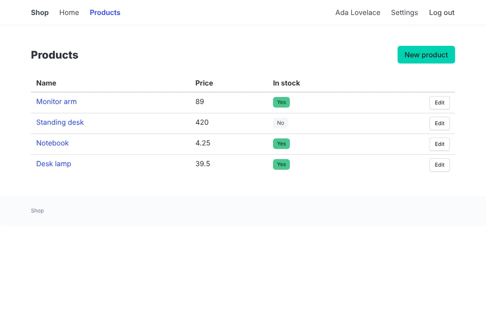
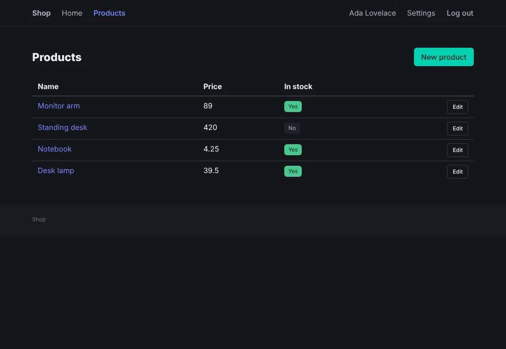
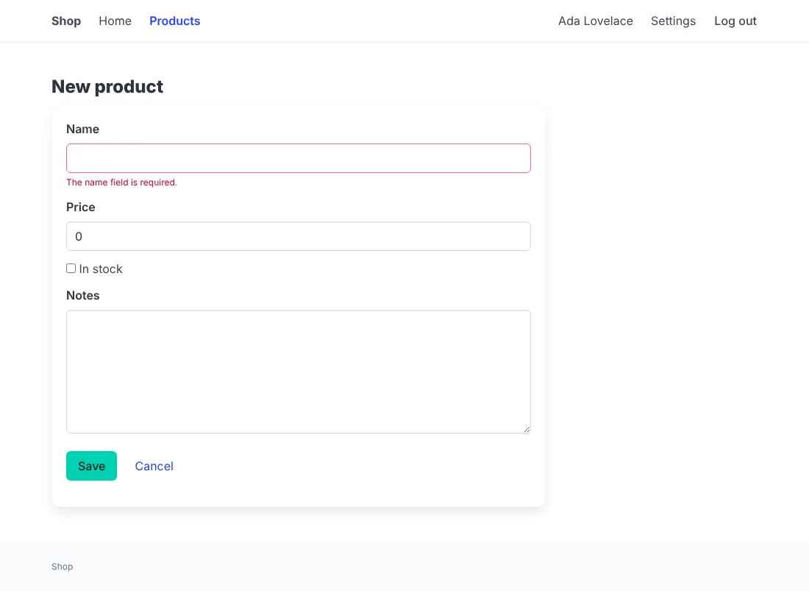
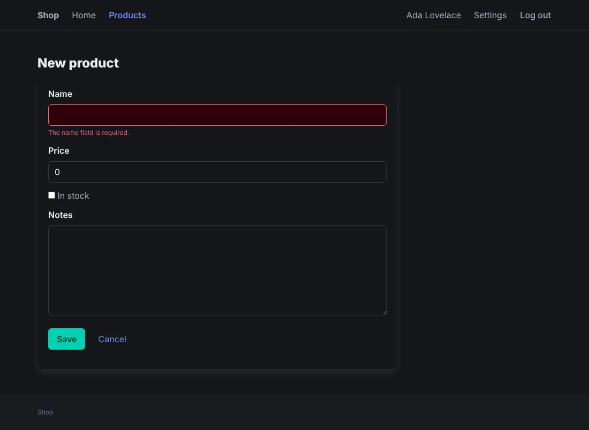
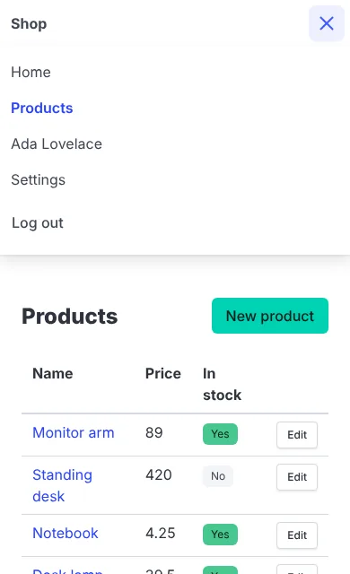

# Style with Bulma

`--css=bulma`: [Bulma](https://bulma.io) 1.0.4's classes and its
stylesheet, as released, with a small script for the menu button. No
build step.





## Before you start

A project made with `anetos new blog --css=bulma`, or switched to it
with `go tool anetos css:use bulma`.

## Steps

### 1. Know its files

| File | Holds |
|---|---|
| `public/static/bulma.min.css` | Bulma as released, with `bulma.LICENSE.txt` (MIT) |
| `public/static/nav.js` | Opens and closes the header's links on a small screen (Bulma has no JavaScript of its own) |
| `public/static/app.css` | The few rules Bulma has no class for (a narrow column, the details' grid, the current page in the header) |
| `views/ui/*.templ` | The components: `navbar`, `box`, `field` and `control`, `notification`, `tag`, `pagination`…; `ui.Main` wraps the page in Bulma's `content`, which styles the pages' plain HTML (headings, lists) |
| `views/ui/classes.go` | The classes of each look (`button is-primary`, `is-danger`, `is-ghost`, `is-small`, `is-fullwidth`) and tone |

A form with its errors:





On a small screen, a menu button opens the header's links. Its name for
screen readers is `nav.menu` in `locales/<locale>/app.yaml` ("Menu"):



### 2. Change its colors

Bulma's colors are CSS variables in hue, saturation and lightness. Set
them in `app.css`, which comes after `bulma.min.css`:

```css
/* illustrative */
:root {
	--bulma-primary-h: 262deg;
	--bulma-primary-s: 83%;
	--bulma-primary-l: 58%;
	--bulma-link-h: 262deg;
	--bulma-link-s: 83%;
	--bulma-link-l: 58%;
}
```

Bulma derives the hover and the hue of the light and dark variants
from them, but keeps its own lightness for the variants and for the
text on the color: for a dark brand color, set
`--bulma-primary-invert-l: 100%;` too, for white text. [Bulma's docs](https://bulma.io/documentation/features/css-variables/)
list the others.

### 3. Use more of Bulma

Its layout (`columns`, `column is-half`), elements (`tags`, `level`,
`media`) and components work in your own components and pages. Bulma's
interactive components (a dropdown, a modal) need a script to open
them, as `nav.js` does for the menu: add yours to `public/static/` and
link it from `ui.Head` in `views/ui/shell.templ`. Keep repeated markup
in a component of `views/ui` ([Style your
app](styling.md#5-add-your-own-component)).

## How it works

Bulma's dark mode follows the visitor's system. `css:use bulma` with
in a project that has it brings a newer Bulma when a newer `anetos`
carries one ([Style your app](styling.md#8-switch-css-frameworks)).

## Common problems

| Symptom | Cause | Fix |
|---|---|---|
| A page's own `<h1>` or list has no style | Outside `ui.Main`'s `content`, Bulma resets plain HTML | Put it in the page's content, or give it Bulma's classes (`title`) |
| The menu button does nothing | `nav.js` isn't loaded (a `ui.Head` you changed), or JavaScript is off | Link `nav.js` from `ui.Head`; without JavaScript, the links stay hidden on small screens |

## Next steps

- [Style your app](styling.md)
- [Bulma's documentation](https://bulma.io/documentation/)
