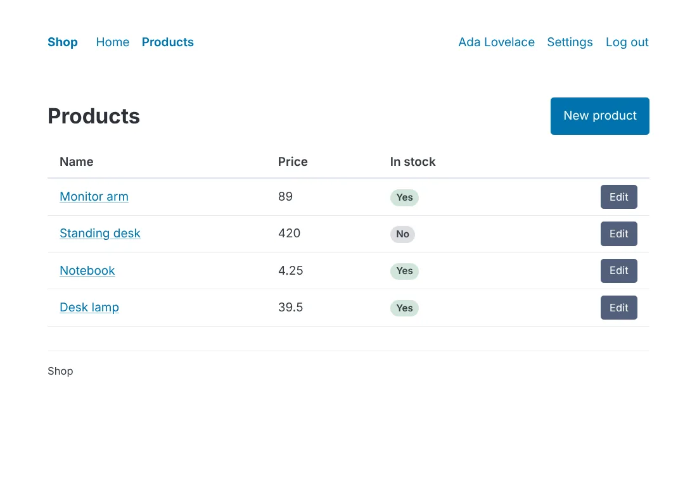
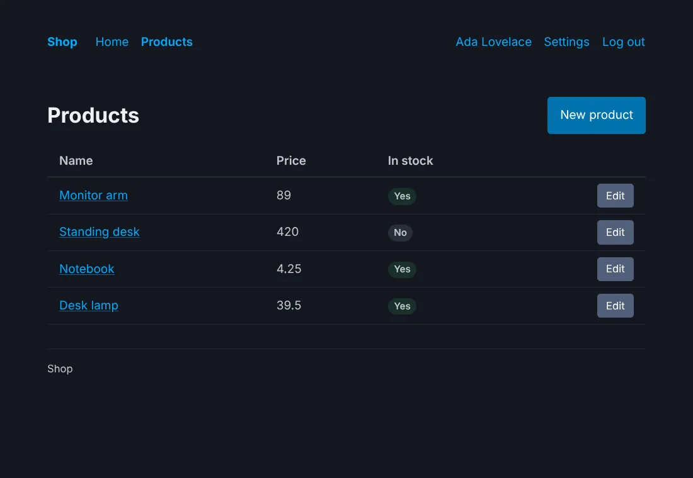
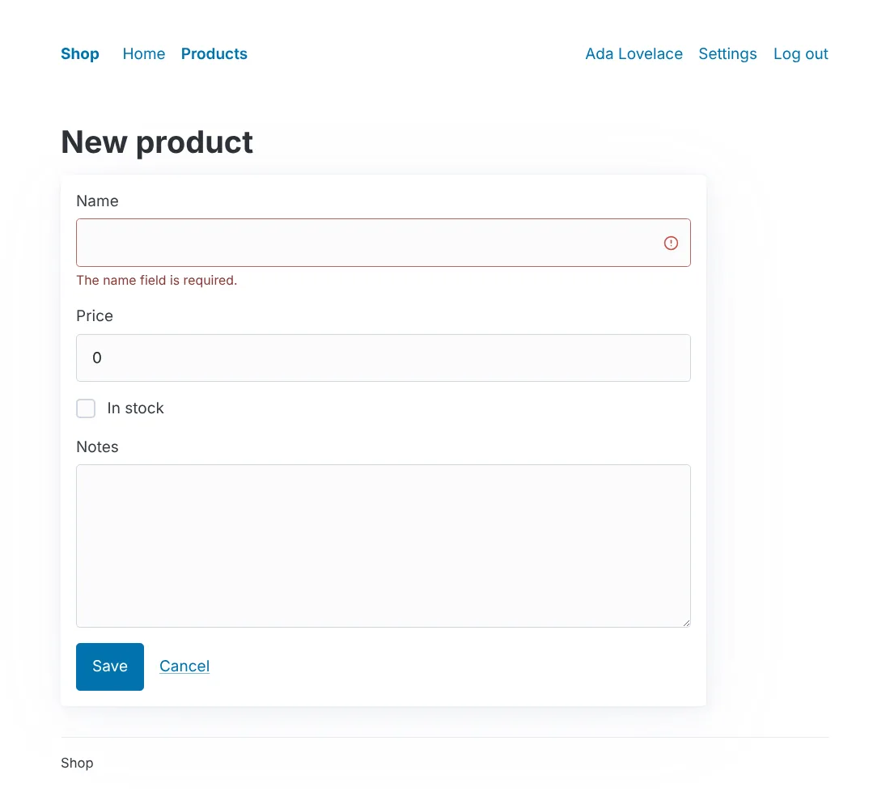
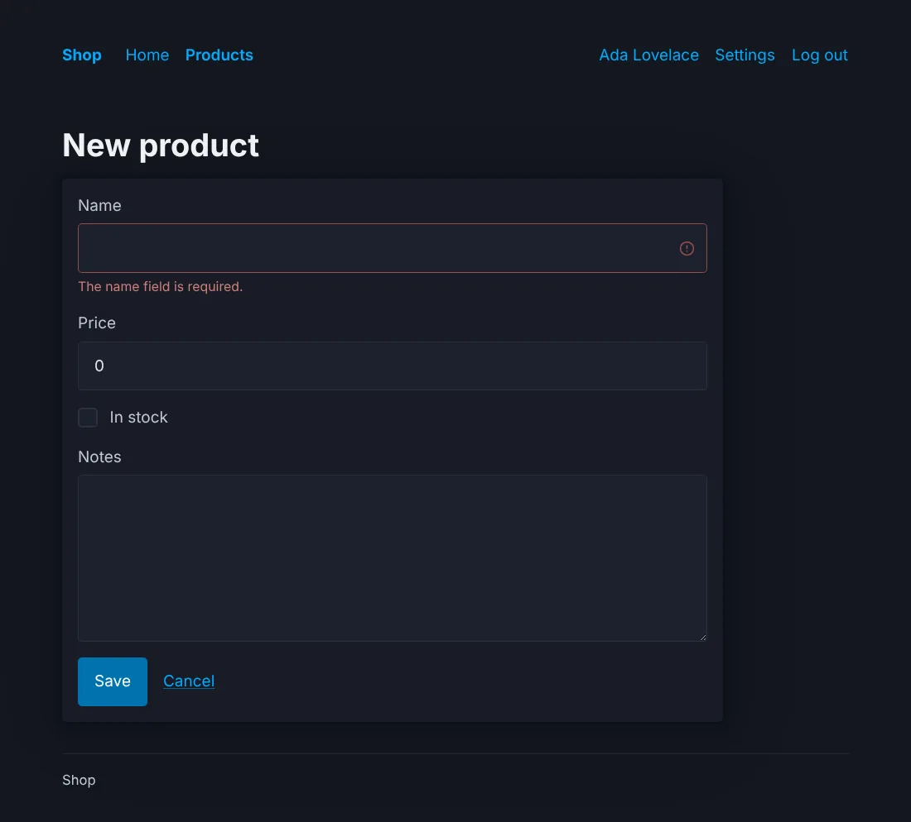

# Style with Pico

`--css=pico`: [Pico CSS](https://picocss.com) 2.1.1, a framework that
styles plain HTML, so its components write few classes. No build step
and no JavaScript.





## Before you start

A project made with `anetos new blog --css=pico`, or switched to it
with `go tool anetos css:use pico`.

## Steps

### 1. Know its files

| File | Holds |
|---|---|
| `public/static/pico.min.css` | Pico as released, with `pico.LICENSE.txt` (MIT) |
| `public/static/app.css` | What Pico has no style of: the header's layout, badges, colored messages, the danger, ghost, small and full buttons |
| `views/ui/*.templ` | The components: `<article>` for a card, `<small>` for a field's message and hint, `<a role="button">` for a link button |
| `views/ui/classes.go` | The classes of each variant and size (`secondary`; `danger`, `ghost`, `small`, `full` from `app.css`) and tone |

The header's links wrap on a small screen; there is no menu button. A
form with its errors (Pico marks the control and colors its message):





### 2. Change its colors

Pico's colors are CSS variables. Set them in `app.css`, which comes
after `pico.min.css`, with Pico's own selectors (a plain `:root` loses
to them):

```css
/* illustrative */
:root:not([data-theme=dark]), [data-theme=light] {
	--pico-primary: #6d28d9;
	--pico-primary-background: #6d28d9;
	--pico-primary-underline: rgba(109, 40, 217, .5);
	--pico-primary-hover: #5b21b6;
	--pico-primary-hover-background: #5b21b6;
	--pico-primary-focus: rgba(109, 40, 217, .25);
}
@media (prefers-color-scheme: dark) {
	:root:not([data-theme]) {
		--pico-primary: #a78bfa;
		--pico-primary-background: #7c3aed;
		--pico-primary-underline: rgba(167, 139, 250, .5);
		--pico-primary-hover: #c4b5fd;
		--pico-primary-hover-background: #6d28d9;
		--pico-primary-focus: rgba(167, 139, 250, .375);
	}
}
[data-theme=dark] {
	--pico-primary: #a78bfa;
	--pico-primary-background: #7c3aed;
	--pico-primary-underline: rgba(167, 139, 250, .5);
	--pico-primary-hover: #c4b5fd;
	--pico-primary-hover-background: #6d28d9;
	--pico-primary-focus: rgba(167, 139, 250, .375);
}
```

[Pico's docs](https://picocss.com/docs/css-variables) list the
others: spacing, radius, font. Pico's other color themes
(`pico.violet.min.css`…) are other files of its release: to use one,
put it in `public/static/` and link it from `ui.Head` in
`views/ui/shell.templ` instead.

### 3. Use more of Pico

Pico styles HTML by its elements and roles, so your own components can
use them without classes: `<div role="group">` for buttons side by
side, `<details class="dropdown">` for a menu without JavaScript,
`<article>` with a `<header>` for a card, `<progress>`, `<dialog>`.
Put them in components of `views/ui` ([Style your
app](styling.md#5-add-your-own-component)).

## How it works

Dark mode is Pico's: it follows the visitor's system, or
`data-theme="dark"` (or `"light"`) on `<html>`. `css:use pico` with the
in a project that has it brings a newer Pico when a newer `anetos` carries
one ([Style your app](styling.md#8-switch-css-frameworks)).

## Common problems

| Symptom | Cause | Fix |
|---|---|---|
| A variable set on `:root` changes nothing | Pico sets it with a more specific selector | Use Pico's selectors, as above |
| A link button doesn't respond to the space bar | It's a link (`<a role="button">`), Pico's way to style one: links follow on Enter | Use a `ui.Button` in a form for actions |

## Next steps

- [Style your app](styling.md)
- [Pico's documentation](https://picocss.com/docs)
