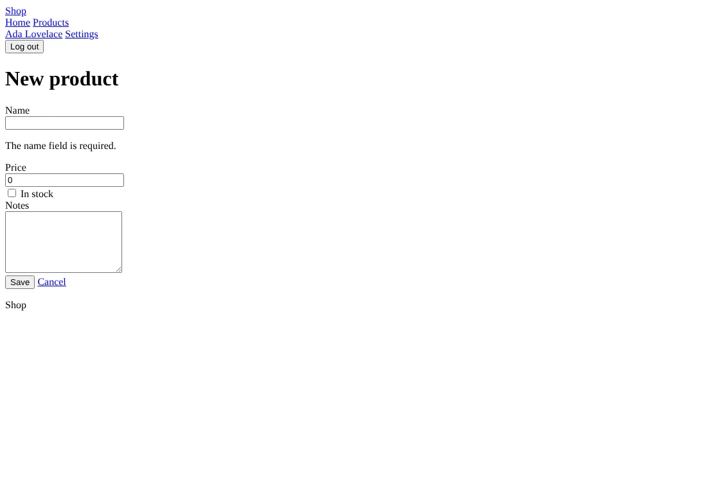

# Start without styles

`--css=none`: the same components, writing plain HTML without
classes, and an `app.css` that holds only a comment. For your own CSS,
or a CSS framework anetos doesn't cover.


## Before you start

A project made with `anetos new blog --css=none`, or switched to it
with `go tool anetos css:use none`.

## Steps

### 1. Know what it writes

The components write elements only: `<header>`, `<nav>`, `<main>`,
`<section>` for a card, `<label>` and `<input>` for a field,
`<table>`. The browser's default styles show them:



A few things change nothing without styles: a button's look, a
message's or a badge's tone, the table's scrolling box. The [UI
components reference](../reference/ui.md#none-plain-html) lists how its
components differ from the others'. There is no `classes.go`.

### 2. Style the elements

Write your rules for the elements in `public/static/app.css`; every
page calls the same components, so the elements are the same
everywhere:

```css
/* illustrative */
body { font-family: system-ui, sans-serif; max-width: 60rem; margin: 0 auto; padding: 1rem; }
header nav a { margin-right: 1rem; }
table { border-collapse: collapse; width: 100%; }
td, th { border-bottom: 1px solid #ddd; padding: .5rem; text-align: left; }
input, select, textarea { display: block; width: 100%; margin-bottom: 1rem; }
[aria-invalid="true"] { border-color: #c00; }
```

### 3. Or give the components your classes

For a framework of your own choice, edit the components in `views/ui`
to write its classes, put its stylesheet in `public/static/`, and link
it from `ui.Head` in `views/ui/shell.templ`. Keep the components' names
and arguments: the pages of `make:crud` and `make:auth` call them.

## Common problems

| Symptom | Cause | Fix |
|---|---|---|
| Buttons all look alike, badges have no color | `none` has no styles: looks and tones write nothing | Style them by element, or switch to a CSS framework that has them |

## Next steps

- [Style your app](styling.md)
- [UI components reference](../reference/ui.md)
