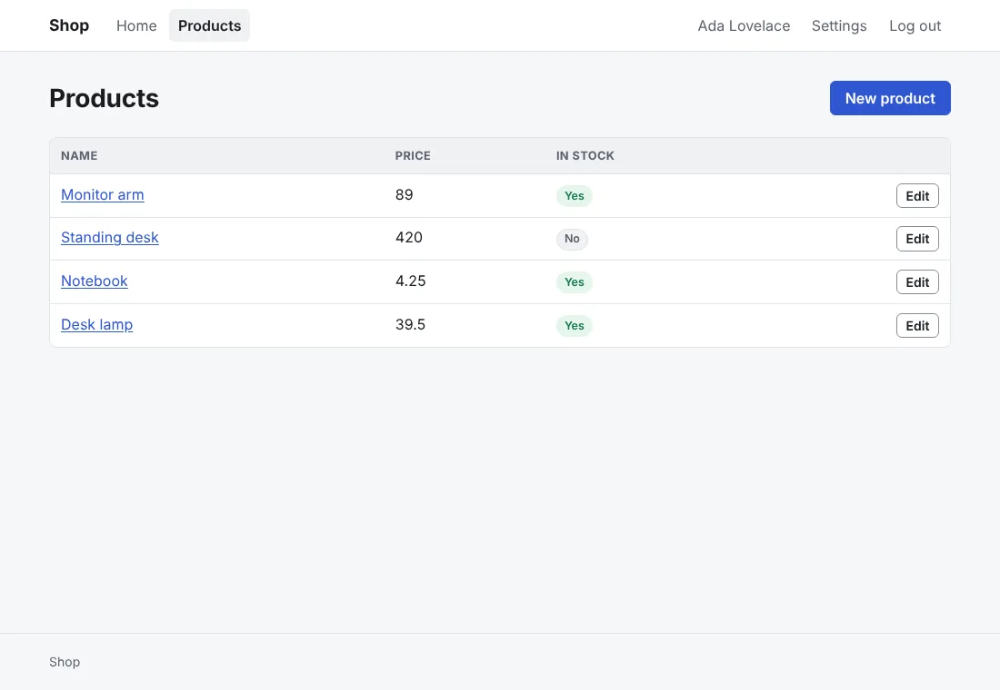
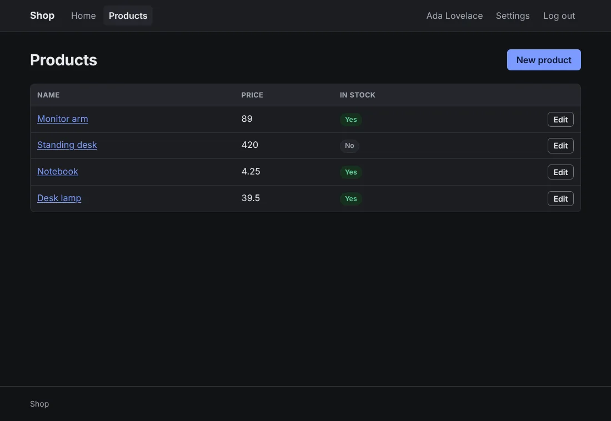
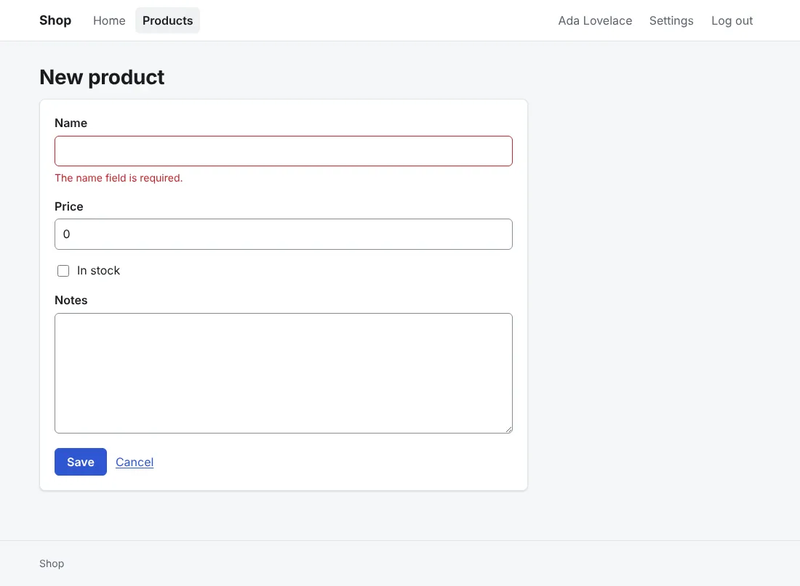
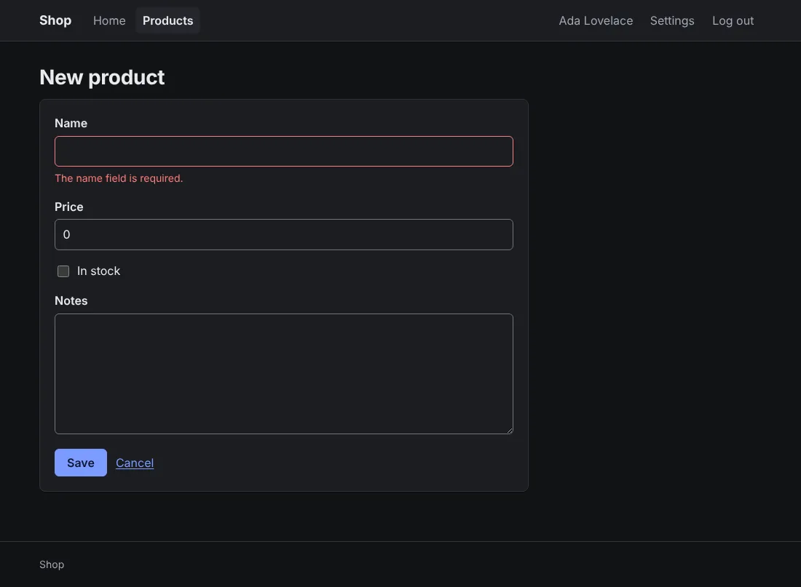

# The starter theme

The starter theme (`--css=anetos`), which `anetos new` writes unless you pick a CSS framework:
Anetos's own stylesheet, about 270 lines of plain CSS, with no
framework and no build step.





## Before you start

A project made with `anetos new` (or `--css=anetos`), or switched to it
with `go tool anetos css:use anetos` ([Style your app](styling.md#8-switch-css-frameworks)).

## Steps

### 1. Know its files

| File | Holds |
|---|---|
| `views/ui/*.templ` | The components, with the theme's classes (`card`, `field`, `badge success`…) |
| `views/ui/classes.go` | The classes of each variant and size (`button secondary small`) and tone |
| `public/static/app.css` | The theme: color variables, light and dark, base styles for plain HTML, then the classes |

Forms and tables need no class: plain HTML looks right as it is. A form
with its errors:





### 2. Change its colors

The variables at the top of `app.css` are the theme's colors, radius,
fonts and width; the dark ones follow twice, in a `prefers-color-scheme`
block and for `data-theme="dark"`. For a brand color, change them in
all three:

```css
/* illustrative */
:root {
	--primary: #7c3aed;
	--primary-hover: #6d28d9;
}
@media (prefers-color-scheme: dark) {
	:root:not([data-theme="light"]) {
		--primary: #a78bfa;
		--primary-hover: #c4b5fd;
	}
}
:root[data-theme="dark"] {
	--primary: #a78bfa;
	--primary-hover: #c4b5fd;
}
```

Edit the values in place rather than adding rules after them. Dark mode
follows the visitor's system; `data-theme="dark"` (or `"light"`) on
`<html>`, in `views/layout.templ`, forces one.

### 3. Use its other classes

`grid` (cards side by side, wrapping) is a class no component uses
yet, for components of your own; `muted`, `stack` and `cluster`, the
classes of `Note`, `Stack` and `Cluster`, are yours to use too. Put the markup in a component
of `views/ui` ([Style your app](styling.md#5-add-your-own-component)),
so its classes stay in one package.

## Common problems

| Symptom | Cause | Fix |
|---|---|---|
| A color change shows in light but not in dark | The dark blocks set the variable too | Change it in the `prefers-color-scheme: dark` block and the `data-theme="dark"` one as well |
| `css:use` refuses to switch: `public/static/app.css` changed | You edited the theme | Commit, run it with `--force`, and carry your colors over to the new stylesheet ([Style your app](styling.md#8-switch-css-frameworks)) |

## Next steps

- [Style your app](styling.md): the components, and the CSS frameworks
- [UI components reference](../reference/ui.md)
