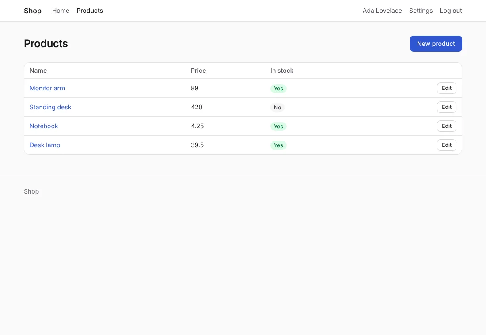

# Style your app

A new project looks finished from the first page. Its pages are made of
components in `views/ui`, a package of your app, styled by one
stylesheet, `public/static/app.css`. Change the colors, change a
component, add your own, start with Pico, Bootstrap or Bulma, or start
without styles.

## Before you start

A project made with `anetos new` v0.5 or later. (A project made before
v0.5 has no `views/ui` yet: see [below](#projects-made-before-v05).)
There is no CDN, and no build step but Tailwind CSS's with the
Tailwind CSS, which `anetos dev` runs for you ([Tailwind
CSS](tailwind.md)): it reloads the page when you save a file.

## Steps

### 1. Know what's there

The look of your app is two parts, which a *CSS framework* writes together:

| File | Holds |
|---|---|
| `views/ui/shell.templ` | The page's shell, which the layout puts together: `Head`, `Header`, `Nav`, `NavLink`, `NavEnd`, `NavItem`, `Main`, `Footer`, `Flash` |
| `views/ui/page.templ` | A page's structure: `PageHeader`, `Card`, `Narrow`, `Stack`, `Cluster`, `Empty`… |
| `views/ui/form.templ` | Forms: `Form`, `Field`, `Input`, `Textarea`, `Select`, `Checkbox`, `Button`, `LinkButton`, `PostButton`… |
| `views/ui/data.templ` | Lists and values: `Table`, `Details`, `Badge`, `Pagination`… |
| `views/ui/ui.go` | The types the components take: `Look`, `Tone`, `Option`, `Pages` |
| `views/ui/classes.go` | The framework's classes for each look and tone (not with `none`) |
| `public/static/app.css` | The starter theme: light and dark, about 270 lines of plain CSS |

Only `views/ui` has class names. The layout (`views/layout.templ`), the
home page and the pages of `make:crud` and `make:auth` call the
components, and use plain HTML elements, without classes, for the rest:
headings, paragraphs, links, table rows. The
[UI components reference](../reference/ui.md) lists every component.

### 2. Build pages with the components

A page calls the components for its structure. The tutorial's list of
issues:

```templ
// IssuesPage lists a page of issues, with links to the pages around it.
templ IssuesPage(page db.Page[models.Issue]) {
	@Layout("Issues") {
		@ui.PageHeader("Issues", "") {
			@ui.LinkButton(web.MustURL(ctx, "issues.new"), ui.Primary) {
				New issue
			}
		}
		if page.Total == 0 {
			@ui.Empty("No issues yet.")
		} else {
			@ui.Table() {
				<tbody>
					for _, issue := range page.Data {
						<tr>
							<td>
								@statusBadge(issue.Status)
							</td>
							<td><a href={ templ.URL(fmt.Sprintf("/issues/%d", issue.ID)) }>{ issue.Title }</a></td>
							<td><small>#{ issue.ID } by { issue.Author.Name }</small></td>
						</tr>
					}
				</tbody>
			}
		}
		if page.LastPage > 1 {
			@ui.Pagination(ui.PagesOf(ctx, page, "Pages", "", "Newer", "Older"))
		}
	}
}

// statusBadge shows an issue's status: green while it's open.
templ statusBadge(status string) {
	if status == "open" {
		@ui.Badge(ui.Success) {
			{ status }
		}
	} else {
		@ui.Badge(ui.Neutral) {
			{ status }
		}
	}
}
```

(Copied from [`examples/tutorial/views/issues.templ`](../../../examples/tutorial/views/issues.templ), region `list`.)

- A component with content takes it as children, in `{ }`:
  `ui.PageHeader` puts its children (the buttons) beside the title.
- A button's look is one of `ui.Primary` (the default), `ui.Secondary`,
  `ui.Danger` and `ui.Ghost`, with `ui.Small` or `ui.Full` added:
  `ui.Secondary|ui.Small`.
- A badge's or a message's tone is `ui.Neutral`, `ui.Success`,
  `ui.Warning`, `ui.Error` or `ui.Info`.
- Components take URLs as strings. `web.MustURL(ctx, name, args...)` is
  the path of a named route, as `web.URL` is, without the error: a name
  that doesn't exist is a panic, which the router answers with a 500
  page ([Render HTML with templ](views.md#2-write-a-layout)).

### 3. Change the colors

The colors, radius, fonts and width are variables at the top of
`app.css`:

```css
/* illustrative */
:root {
	--primary: #3056d3;       /* links and buttons */
	--primary-hover: #2445b4;
	--radius: 8px;
	--font: system-ui, sans-serif;
	--width: 64rem;           /* the page's width */
}
```

Change `--primary` and `--primary-hover` for your brand. Dark mode
follows the visitor's system and has its own values below; set
`data-theme="dark"` (or `"light"`) on `<html>` in `views/layout.templ`
to force one.

### 4. Change a component

The components are yours: change the markup they write, and every page
that calls them follows. Keep each component's name and arguments:
the pages of `make:crud` and `make:auth` call them as they are. For
example, an empty list with a picture, in `views/ui/page.templ`
(which then imports your module's `public` package, as `shell.templ`
does):

```templ
// illustrative
// Empty says a list has nothing in it yet.
templ Empty(text string) {
	<div class="empty">
		
		<p>{ text }</p>
	</div>
}
```

Then add the rules for it at the end of `app.css`. If a component needs
another argument, add a new component rather than change the old one's
signature; if you do change it, `go build` lists every call to update.

### 5. Add your own component

Markup you repeat belongs in a component of its own. Put it in
`views/ui`, in a file of your own, so the class names stay in one
package:

```templ
// illustrative
package ui

// Stat is a number with its label, as on a dashboard.
templ Stat(label, value string) {
	<div class="card stat">
		<p class="muted">{ label }</p>
		<p class="stat-value">{ value }</p>
	</div>
}
```

A page calls it like the others: `@ui.Stat("Open issues",
strconv.Itoa(open))`. The theme has a few classes that no component
uses yet, such as `grid` (cards side by side, wrapping), for components
of your own.

### 6. Add your own stylesheets

Add rules at the end of `app.css`, or put another file in
`public/static/` and link it from `ui.Head`, in `views/ui/shell.templ`:

```templ
// illustrative
templ Head() {
	<link rel="stylesheet" href={ public.Assets.URL("app.css") }/>
	<link rel="stylesheet" href={ public.Assets.URL("mine.css") }/>
}
```

`public.Assets.URL` adds a version to the URL, so browsers fetch the new
file after a deploy; the binary embeds `public/`.

### 7. Or start with a CSS framework

`anetos new` writes the starter theme. `--css` picks a CSS framework instead:

```sh
anetos new blog --css=bootstrap
```

| `--css` | The components' markup | `public/static/` | Guide |
|---|---|---|---|
| `anetos` (the default) | The starter theme's classes | `app.css`: the starter theme | [The starter theme](starter-theme.md) |
| `none` | Plain HTML without classes | `app.css`: a comment, for your styles | [Start without styles](plain-html.md) |
| `pico` | [Pico CSS](https://picocss.com) 2.1.1: mostly plain HTML, which Pico styles | `pico.min.css`, `app.css` (what Pico has no style of) | [Pico](pico.md) |
| `bootstrap` | [Bootstrap](https://getbootstrap.com) 5.3.8's classes | `bootstrap.min.css`, `bootstrap.bundle.min.js`, `theme.js`, `app.css` | [Bootstrap](bootstrap.md) |
| `bulma` | [Bulma](https://bulma.io) 1.0.4's classes | `bulma.min.css`, `nav.js`, `app.css` | [Bulma](bulma.md) |
| `tailwind` | [Tailwind CSS](https://tailwindcss.com) 4.3.3's utility classes | `app.css`, compiled from `views/ui/tailwind.css` | [Tailwind CSS](tailwind.md) |

The same page, a list that `make:crud` wrote, with each:

| `--css` | The products list |
|---|---|
| `anetos` |  |
| `none` |  |
| `pico` |  |
| `bootstrap` |  |
| `bulma` |  |
| `tailwind` |  |

Each writes the same components, with the same names and
arguments, so the layout, the home page and the pages of `make:crud` and
`make:auth` are the same with each: only `views/ui` and
`public/static/` differ. Each but `none` follows the visitor's light or
dark mode. A framework's files are as released, with its license beside
them (`pico.LICENSE.txt`: MIT, as are the others); the binary embeds
them, and serves them gzipped to browsers that accept it. Each one's
guide shows its pages in light and dark, and how to change its colors
and use more of its framework.

A CSS framework is `views/ui` with its `public/static/` files, so another
restyles every page that calls the components: [step 8](#8-switch-css-frameworks)
switches a project's.

### 8. Switch CSS frameworks

```sh
go tool anetos css:use bulma
```

switches the project to another CSS framework. It writes its components
(`views/ui`) and stylesheets (`public/static/`), removes the old one's
files the new one hasn't (`pico.min.css`, `theme.js`, `tailwind.css`…),
and runs `templ generate` (and, for Tailwind, `css:build`). The layout,
the pages and your own files in `views/ui` stay as they are: the pages
call the components, so every one of them takes the new look.
`go tool anetos css:use` alone prints the project's.

`views/ui/css.json` records the CSS framework: its name, its version,
and the SHA-256 of each file it wrote (`anetos new` writes it, and
`css:use` updates it). With it, `css:use` knows which of those files you
changed since: a component you edited, your colors in `app.css`. It
names them and writes nothing:

```text
anetos css:use: these files changed since anetos wrote them for the starter theme, or aren't its:
  public/static/app.css
  views/ui/page.templ
Nothing was written. Run again with --force to replace them (commit first: git then shows what changed), or undo the changes.
```

`--force` replaces them; commit first, and `git diff` shows what to
carry over (your colors into the new stylesheet, say). A project
without `css.json` (or with one it can't read) needs `--force` too;
then it can't tell the old framework's static files from yours, so it lists
the files of `public/static/` it left for you to remove. A file of
`views/ui` or `public/static` that is a symbolic link counts as changed. Line endings don't: git
on Windows may check files out with CRLF.

After the switch, `css:use` builds the project: when your own code
called something only the old framework's components had (an
unexported helper of its `classes.go`), it says so and exits with status 1. It adds `nav.menu`
to `locales/en/app.yaml` when missing, and names the other locales to
translate it in.

`css:use` with the framework the project already has updates its files
to your `anetos`'s version (after `go get -tool
anetos.dev/anetos/cli/cmd/anetos@latest`: a newer Pico, fixed
components), under the same rule. Moving to or from Tailwind, it says
which cache line to add to (or remove from) your `Dockerfile`; it
doesn't edit it.

### Pages with classes of your own

A page can still use classes of its own (`<div class="hero">`), styled
by your rules in `app.css`. They keep working, but they are outside the
components: `css:use` restyles the components, not your pages' classes, and
says which of your own files in `views/ui` keep theirs. When the markup
repeats, make it a component (step 5).

## Projects made before v0.5

A project made before v0.5 has no `views/ui`: its layout and pages
carry the starter theme's classes themselves. Nothing changes until
you run a generator. The first `make:crud` or `make:auth` writes
`views/ui` before the pages that call it, and says so:

```text
views/ui has the components for the starter theme, which the new pages call: the project had none (made before v0.5).
The layout keeps its markup; the upgrade guide shows how to use them there too.
```

It picks the CSS framework from your stylesheet: `anetos` when
`public/static/app.css` has the starter theme's `.card` rule, else
`none` (classless markup, for a stylesheet of your own). It doesn't
change `app.css`, the layout or your other pages. Both kinds of layout
work with the generators: `make:crud` adds its link at the end of the
header's nav, and `make:auth` adds `@AccountMenu()` after it, whether
the nav is a `<nav>` or a `@ui.Nav` block.

To build the layout from the components too, compare it with the
`views/layout.templ` of a new project (`anetos new` in another folder):
`@ui.Head()` in `<head>`, then `ui.Header`, `ui.Nav`, `ui.Main`,
`ui.Footer` and `ui.Flash` in place of the markup with classes.

## How it works

`views/ui` is an ordinary package of your app. Nothing in the framework
imports it, and updating Anetos never changes it, or `app.css`: a newer
version's components come when you ask for them, with `css:use` and
your framework's name ([step 8](#8-switch-css-frameworks)).

Some components read the request's context (`ctx`): `ui.Form` adds the
CSRF token, `ui.Field` shows its field's validation message, and
`ui.Input`, `ui.Textarea`, `ui.Select` and `ui.Checkbox` are marked
`aria-invalid="true"` when their field failed validation, which the
stylesheet shows with a red border. `ui.NavLink` marks the current page with
`aria-current="page"` (the layout's `navLink` asks `web.RouteIs`), which
the stylesheet highlights. A header entry that isn't a link (the logout button)
is in a `ui.NavItem`, which each CSS framework wraps as its menus need.

The theme is variables, then base styles for the elements, then the
classes. Forms and tables need no class: plain HTML looks right as it
is.

## Common problems

| Symptom | Cause | Fix |
|---|---|---|
| `undefined: ui.Stat` (or another component) | `views/ui` has no such component: it was renamed, deleted, or never there | Add it to `views/ui`, or copy it from a new project's |
| A generated page doesn't build after you changed a component | The pages of `make:crud` and `make:auth` call the component's old arguments | Keep the signature; add a new component for the new arguments |
| A 500 page and `web: unknown route name` in the log | `web.MustURL` was given a route name that doesn't exist | Fix the name; `go run . route:list` lists them |
| The new pages of a project made before v0.5 have no style | `app.css` has no `.card` rule, so the classless components (`none`) were written | Style the elements, or give the components your classes |

## Next steps

- [UI components reference](../reference/ui.md): every component and
  its arguments
- [Add pages for a model](../getting-started/crud.md) with `make:crud`
- [Render HTML with templ](views.md)
