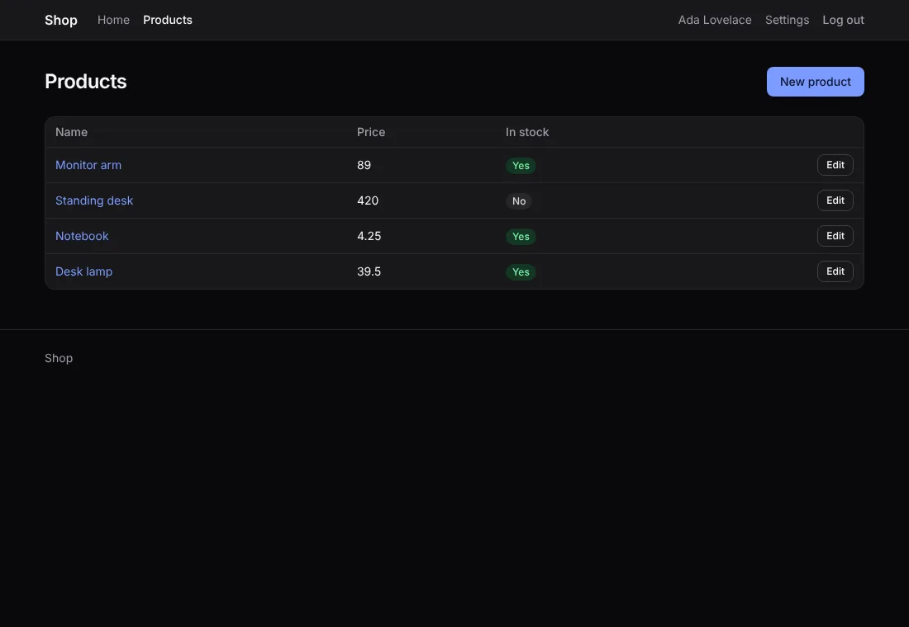
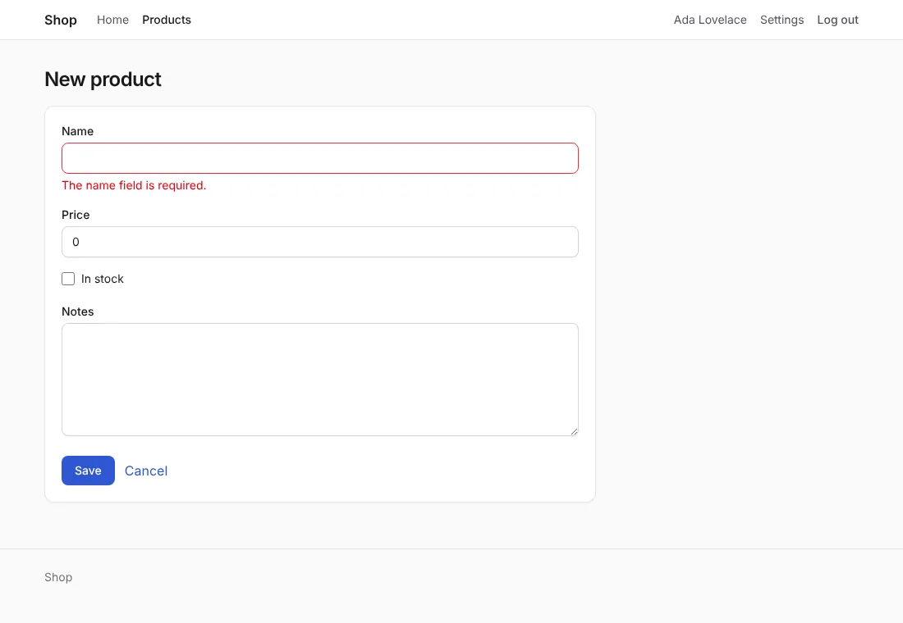
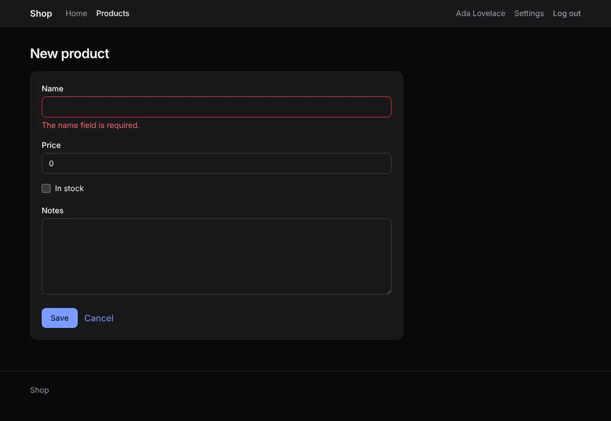

# Style with Tailwind CSS

`--css=tailwind`: components with [Tailwind CSS](https://tailwindcss.com)
4.3.3's utility classes, and a stylesheet that Tailwind compiles from
them. `anetos dev` and `anetos build` run Tailwind's standalone CLI for
you: no Node.js.




## Before you start

A project made with `anetos new blog --css=tailwind`, or switched to it
with `go tool anetos css:use tailwind`. The first compile downloads
Tailwind CSS (80 to 112 MB, once): see [How it works](#how-it-works).

## Steps

### 1. Know its files

| File | Holds |
|---|---|
| `views/ui/tailwind.css` | The source: `@import "tailwindcss" source("..")` (Tailwind looks for classes in `views/`), the accent color in `@theme`, and the look of the pages' plain HTML (headings, lists, table cells) |
| `public/static/app.css` | What Tailwind compiles from it, minified: the stylesheet the pages link. Commit it, as the `_templ.go` files: `go build`, `go test` and the `Dockerfile` use it as it is |
| `public/static/tailwind.LICENSE.txt` | Tailwind's license (MIT): `app.css` carries its code |
| `views/ui/*.templ` | The components, with utility classes |
| `views/ui/classes.go` | The classes of each variant, size and tone, and of the form controls |

A new project's `app.css` comes compiled: it has every class of the
components, and the pages of `make:crud` and `make:auth` add none, so
they look right before Tailwind ever runs. A form with its errors:





### 2. Add classes, and let Tailwind compile them

When you add a class to a page or a component, Tailwind writes its
rule:

- `go tool anetos dev` compiles `app.css` before each rebuild, when a
  templ file, a Go file or `tailwind.css` changes (about 0.2 s);
- `go tool anetos build` compiles it before building the binary;
- `go tool anetos css:build` compiles it alone, and `css:build --check`
  fails when it's out of date (for CI).

A class must be written whole in a file of `views/`: Tailwind finds
`bg-red-600` in `"bg-red-600"`, not in `"bg-" + color`.

### 3. Change its colors

The accent (links, the primary button, focus rings) is `@theme`'s
`--color-accent` in `tailwind.css`, with its dark values below it:

```css
/* illustrative */
@theme {
	--color-accent: #7c3aed;
	--color-accent-hover: #6d28d9;
	--color-on-accent: #ffffff;
}
```

The grays are Tailwind's `zinc`, with `dark:` variants in the
components; change them there. Dark mode follows the visitor's system.

## How it works

`anetos` runs Tailwind's standalone CLI. The first run downloads
Tailwind CSS 4.3.3 for your computer (Linux, macOS or Windows) from its
GitHub releases into your user cache directory
(`~/Library/Caches/anetos/tailwindcss/` on macOS,
`~/.cache/anetos/tailwindcss/` on Linux,
`%LocalAppData%\anetos\tailwindcss\` on Windows), and checks its
SHA-256 against the one written in `anetos`, then again before each
run. On Alpine Linux, the musl build it downloads needs `apk add
libstdc++ libgcc`. Offline, or on another platform, download a
`tailwindcss` binary yourself and set `ANETOS_TAILWIND` to its path.
When Tailwind can't run, `anetos dev` says why and keeps the `app.css`
there is until you restart it, so new classes aren't styled yet;
`anetos build` and `css:build` fail. A Tailwind project's `Dockerfile`
keeps the download in BuildKit's cache ([Deploy](deployment.md)).

## Common problems

| Symptom | Cause | Fix |
|---|---|---|
| A class you added has no effect | `app.css` wasn't compiled since (no `anetos dev` running, or Tailwind couldn't run: its message says why), or the class is built from pieces | Run `go tool anetos css:build`; write the class whole |
| `anetos dev` says it can't download Tailwind CSS | Offline, a proxy, or a platform without a standalone CLI | Download the binary the message names, and set `ANETOS_TAILWIND` to its path |
| `tailwind: tailwindcss-… has SHA-256 …, not …` | The download isn't the release `anetos` was made for (altered, or cut off) | Nothing is run; try again, or use `ANETOS_TAILWIND` with a binary you trust |
| CI fails `css:build --check` | `app.css` wasn't compiled after a change of classes | Run `go tool anetos css:build` and commit `app.css` |

## Next steps

- [Style your app](styling.md)
- [Tailwind's documentation](https://tailwindcss.com/docs)
